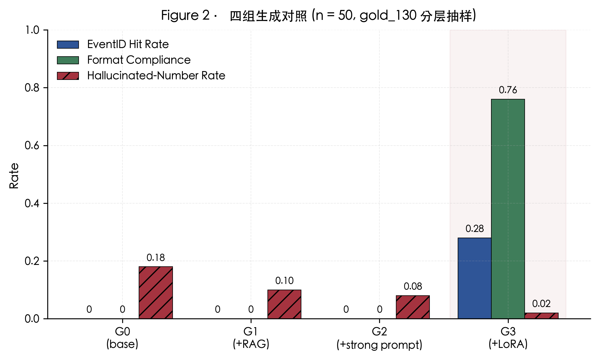
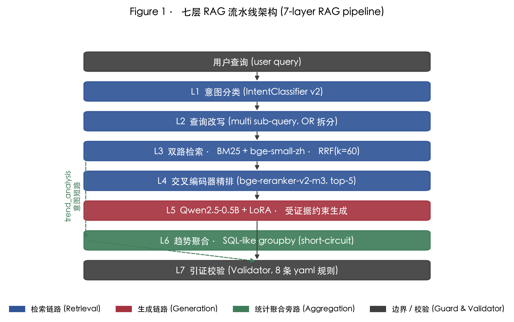
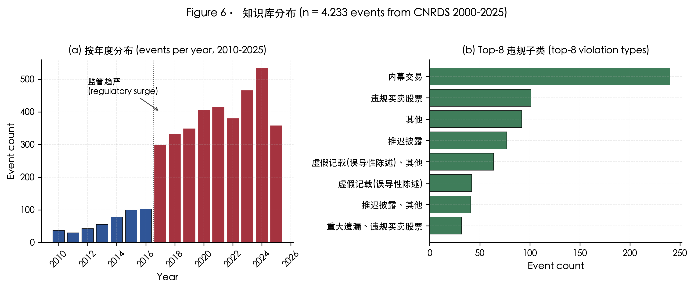
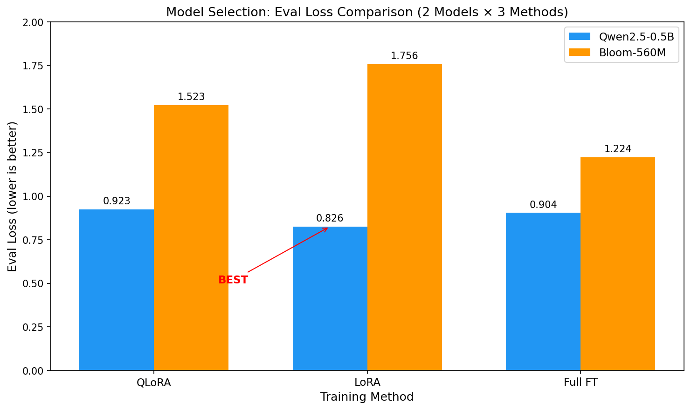
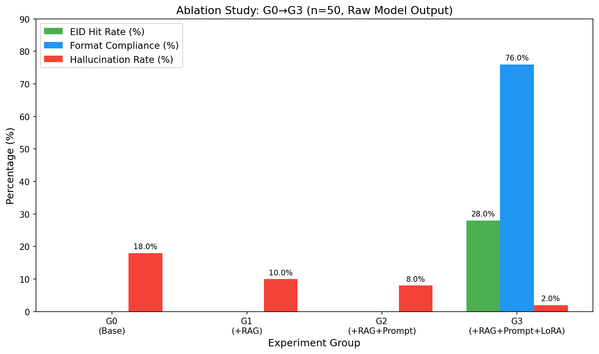
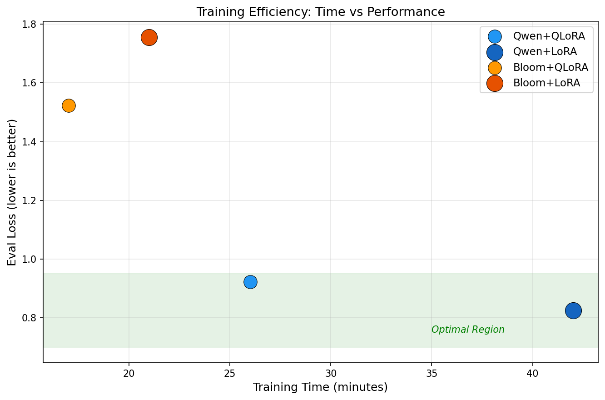
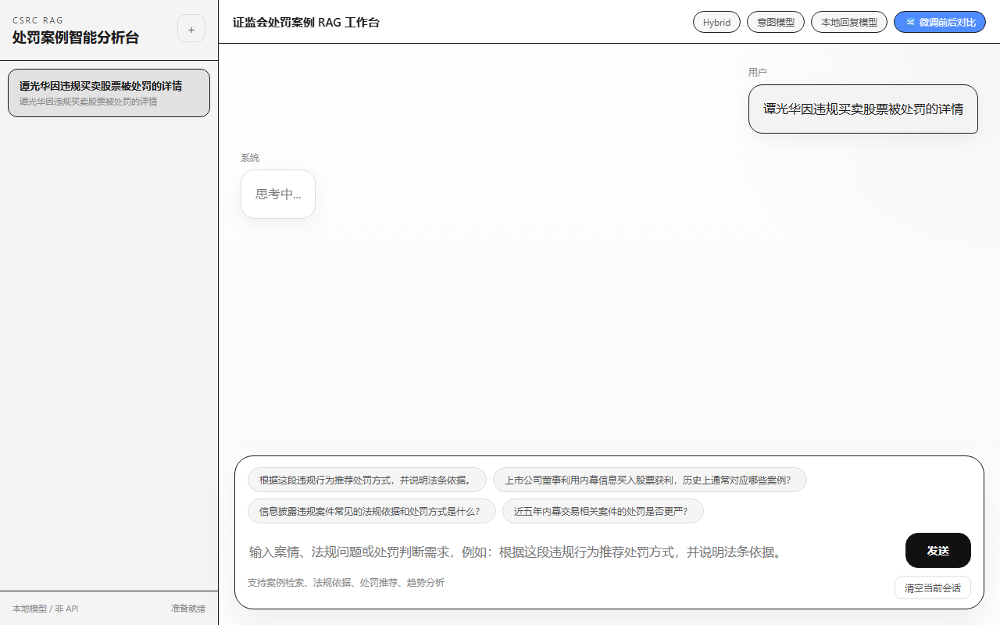
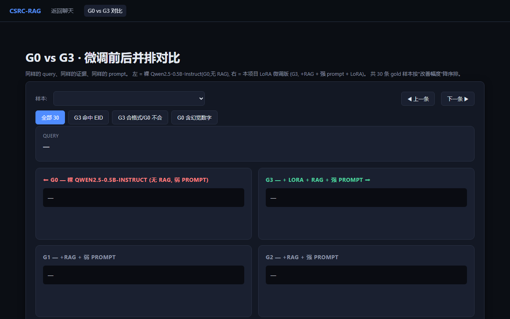

# CSRC-RAG: A RAG-based Intelligent Q&A System for Securities Regulatory Penalty Cases with LoRA Fine-tuning and Multi-layer Hallucination Control

# 证监会违规案例智能检索与问答系统

<p align="center">
  
  
  
  
</p>

**深度学习课程设计 · 赛道 B（垂直领域智能问答）** · 2026.04

作者：许浩财 · Jia Tong · 戴一鑫 · 张彦扬 · 王怡菲

---

## 一、我们做了什么

**一句话**：把 4,233 条证监会行政处罚公告变成一个**会精确引用、拒绝编造**的智能问答助手。

<p align="center">
  
  <br/>
  <sub><b>Figure 1</b> · G0-G3 四组核心指标对比 —— 只有 G3(+LoRA) 实现了格式合规和幻觉控制</sub>
</p>

### 背景问题

通用大模型在中国证券违规案例问答场景下有三个致命短板：

| 问题 | 表现 | 后果 |
|------|------|------|
| **幻觉** | 编造不存在的法条、罚款金额、公司名称 | 误导合规从业人员 |
| **格式不合规** | 不遵守结构化引用格式 | 无法追溯、不可审计 |
| **检索召回低** | 领域术语向量化质量差 | 错过关键案例 |

### 我们的解决方案

用 **RAG + LoRA 指令微调 + 规则校验** 三层防线系统性解决，在 **<1B 参数量、8GB 消费级 GPU** 的硬约束下实现：

| 指标 | 微调前 (G0) | 微调后 (G3) | 提升 |
|------|:-----------:|:-----------:|:----:|
| 幻觉数字率 ↓ | 18.0% | **2.0%** | -89% |
| 格式合规率 ↑ | 0% | **76.0%** | 从无到有 |
| 事件ID命中率 ↑ | 0% | **28.0%** | 从无到有 |

---

## 二、技术架构：七层流水线

<p align="center">
  
  <br/>
  <sub><b>Figure 2</b> · 七层 RAG 流水线架构</sub>
</p>

### 2.1 整体架构

```
用户 query: "谭光华因违规买卖股票被处罚的详情?"
    │
    ▼
┌─────────────────────────────────────────────────────────┐
│ L1 意图分类 (TF-IDF + LogReg, Macro-F1 = 0.9989)       │
│     7 类: greeting / chitchat / out_of_scope /          │
│           case / law / sanction / trend                  │
└─────────────────────────────────────────────────────────┘
    │
    ▼
┌─────────────────────────────────────────────────────────┐
│ L2 查询改写（共指消解 + 同义词扩展 + 多约束拆分）        │
└─────────────────────────────────────────────────────────┘
    │
    ▼
┌─────────────────┬───────────────────────────────────────┐
│ L3a BM25        │ L3b bge-small-zh-v1.5 (512维 cosine)  │
│ jieba + 领域词典 │ 每路召回 top-100                      │
└────────┬────────┴────────┬──────────────────────────────┘
         └─── RRF(k=60) ────┘
                 │
                 ▼
┌─────────────────────────────────────────────────────────┐
│ L4 交叉编码器精排 (bge-reranker-v2-m3, events top-50)   │
└─────────────────────────────────────────────────────────┘
                 │
                 ▼
┌─────────────────────────────────────────────────────────┐
│ L5 生成：Qwen2.5-0.5B + LoRA 生成                              │
│     r=16, α=32, 4-bit NF4 量化, 全 attention+FFN 层     │
└─────────────────────────────────────────────────────────┘
                 │
                 ├── [trend 意图] ──▶ L6 趋势聚合器 (SQL-like groupby)
                 │
                 ▼
┌─────────────────────────────────────────────────────────┐
│ L7 引证校验 (Validator, 8 条 YAML 规则)                  │
│     • 对 L5 输出做事后校验，非生成环节                    │
│     • EID 必须在证据中 • 法条必须在证据中                │
│     • 不得出现证据外的罚款金额 • 失败→降级话术           │
└─────────────────────────────────────────────────────────┘
                 │
                 ▼
        "参考历史相似案例... [EventID=40111147]..."
```

### 2.2 各层技术选型

> 详细选型理由与候选对比见 [`docs/model_selection.md`](docs/model_selection.md)

| 层 | 组件 | 技术 | 选型理由 |
|---|---|---|---|
| L1 | 意图分类 | TF-IDF + LogReg | F1=0.9989，更复杂模型无收益 |
| L3 | 稠密检索 | bge-small-zh-v1.5 | 99MB，中文MTEB Top-3，显存友好 |
| L4 | 精排 | bge-reranker-v2-m3 | 中文最优 cross-encoder |
| L5 | 生成 | Qwen2.5-0.5B + LoRA | **实验证明 LoRA 泛化优于 QLoRA 和 Full FT** |
| L5 | 微调 | LoRA r=16, α=32 | eval_loss=0.826，最优训练方式 |

### 2.3 大模型 Prompt 设计

系统通过两层 prompt 控制生成行为：

**System Prompt（角色约束）**：
```
你是证监会处罚案例智能分析助手。你只能根据给定案例证据回答，禁止编造
未出现的法条、处罚结果、金额或事实。如果证据不足，请明确写"证据不足"。
```

**Instruction Prompt（任务约束，按类别不同）**：
```
根据检索到的证监会处罚案例，回答用户关于主体、人员、监管机构或证券代码
的查询。只能使用证据中出现的案例，并逐条引用 [EventID=xxx]。
```

**完整输入结构**：
```
[System] 角色约束
[User]   Instruction + 用户问题 + [检索证据] 案例1/2/3...
[Assistant] 结构化回答 + [EventID=xxx] 引证
```

---

## 三、数据：从哪来、怎么用

### 3.1 数据来源

<p align="center">
  
  <br/>
  <sub><b>Figure 5</b> · 知识库语料分布（左：按年度，右：Top-8 违规子类，n=4,233）</sub>
</p>

| 数据源 | 说明 | 规模 |
|--------|------|------|
| CSMAR 证监会处罚信息表 | 原始结构化数据 | 14,740 行 × 24 列 |
| 事件级文档 | 按 EventID 聚合的完整案例 | 4,233 篇 |
| 事件 Chunks | 按段落切分的检索单元 | 29,314 段 |

### 3.2 训练数据

**来源**：基于原始案例自动构造 + 人工校验，Alpaca 格式

| 文件 | 样本数 | 类别分布 | 用途 |
|------|--------|---------|------|
| `data/processed/rag_qa_train.jsonl` | 5360 | A-H 8类 | LoRA 训练 |
| `data/processed/rag_qa_val.jsonl` | 670 | A-H 8类 | 验证集 |
| `data/processed/rag_qa_test.jsonl` | 550 | A-H 8类 | 最终评测 |

**八类任务**（与训练标签 `configs/qlora_config.json` 的 `category_counts` 一致）：
- **A** - 案例检索（case_retrieval）：按主体/机构/证券代码查找处罚案例
- **B** - 法条依据（law_grounding）：定位并引用处罚所依据的法律条文
- **C** - 处罚推荐（sanction_recommendation）：基于相似案例对比推荐处罚方式
- **D** - 趋势分析（trend_analysis）：跨案例/跨年度统计与对比
- **E** - 越界拒答（refusal_out_of_scope）：对超出知识库范围的问题拒答
- **F** - 证据不足（insufficient_evidence）：证据不充分时保守说明"证据不足"
- **G** - 多轮对话（multiturn）：结合上文的连续问答
- **H** - 反幻觉负样本（anti_hallucination_negatives）：专门训练"不编造"的负例

> 其中 **E / F / H** 三类负样本是系统"会拒答、少幻觉"的关键来源。

### 3.3 评测数据

| 文件 | 样本数 | 用途 |
|------|--------|------|
| `data/eval/gold_130.jsonl` | 130 | 检索层精度评测 |
| `data/eval/intent_eval_1211.jsonl` | 1,211 | 意图分类独立评测 |
| `data/eval/gold_trend_30.jsonl` | 30 | 趋势聚合评测 |

### 3.4 数据样例

**训练数据格式** (Alpaca-style JSONL)：

```json
{
  "event_id_source": "401444",
  "category": "A",
  "split": "train",
  "instruction": "根据检索到的证监会处罚案例，回答用户关于主体、人员、监管机构或证券代码的查询。只能使用证据中出现的案例，并逐条引用 [EventID=xxx]。",
  "input": "用户问题：股票代码000677对应主体有什么处罚案例？\n\n[检索证据]\n案例1：\n  EventID=403932\n  标题：中国证监会行政处罚决定书（陈宝庆、李文静）\n  公告日期：2012-12-21\n  违规类型：内幕交易\n  ...",
  "output": "根据检索证据，查询到 3 条与证券代码「000677」相关的处罚记录：「中国证监会行政处罚决定书（陈宝庆、李文静）」（2012-12-21），违规类型：内幕交易，处罚类型：其他、罚款 [EventID=403932]；... 以上结论仅基于当前证据。"
}
```

**评测数据格式** (意图分类)：

```json
{"question": "若将人工智能辅助工具引入退市听证流程，可能带来哪些治理效能提升？", "label": "IN_SCOPE"}
{"question": "今天天气冷不冷", "label": "OUT_OF_SCOPE"}
```

---

## 四、如何验证模型好坏：6 项评测指标

我们设计了 **6 项指标**，覆盖系统全链路和微调效果两个维度：

### 4.1 系统评估指标（3 项）

| 指标 | 定义 | 学术引用 |
|------|------|---------|
| **Hallucinated Number Rate** | 生成的数值声明中无证据支撑的比例 | RAGTruth (ACL 2024), RAGAS (EACL 2024) |
| **Event ID Hit Rate** | 回答中包含正确 EventID 的比例 | Manning IR, Practical RAG Eval (2024) |
| **Format Compliance** | 输出通过 L7 校验规则的比例 | StructEval (2025) |

### 4.2 微调效果指标（3 项）

| 指标 | 定义 | 学术引用 |
|------|------|---------|
| **Task Accuracy** | 关键字段与标准答案完全匹配的比例 | LoRA (Hu et al., ICLR 2022) |
| **Entity F1** | 领域实体（公司/金额/违规类型）的 Micro-F1 | CoNLL-2003 NER, 金融NER文献 |
| **Instruction Following** | 同时满足格式+字段+结构约束的比例 | Vicuna (Chiang 2023), StructEval (2025) |

### 4.3 实验结果

#### 模型选型实验（2 模型 × 3 训练方式）

<p align="center">
  
  <br/>
  <sub><b>Figure 6</b> · 模型选型：Qwen-0.5B vs Bloom-560M × QLoRA/LoRA/Full FT</sub>
</p>

| 实验 | 模型 | 训练方式 | Eval Loss↓ | 训练时间 | 结论 |
|------|------|---------|---:|---:|---|
| M1_T1 | Qwen-0.5B | QLoRA (4-bit) | 0.923 | 26min | 最省资源 |
| **M1_T2** | **Qwen-0.5B** | **LoRA (fp32)** | **0.826** ⭐ | **42min** | **最优** |
| M1_T3 | Qwen-0.5B | Full FT | 0.904 | 30h | 过拟合+太慢 |
| M2_T1 | Bloom-560M | QLoRA (4-bit) | 1.523 | 17min | 远差于Qwen |
| M2_T2 | Bloom-560M | LoRA (fp32) | 1.756 | 21min | 最差 |
| M2_T3 | Bloom-560M | Full FT | 1.224 | 19h | 过拟合 |

**选型结论**：
1. **Qwen-0.5B 全面优于 Bloom-560M**（eval_loss 低 40-50%），得益于原生中文预训练
2. **LoRA 是最优训练方式**（eval_loss 最低 0.826），QLoRA 牺牲少量精度换取 38% 加速
3. **Full FT 严重过拟合**（train_loss 极低但 eval_loss 反弹），且时间不可接受

> **Eval Loss 含义**：在模型未见过的验证集（670 条）上计算交叉熵损失，衡量模型对新数据的预测准确度。越低说明泛化能力越强，越高说明模型在训练集上过拟合。

#### 消融实验（G0→G3，模型原生输出）

<p align="center">
  
  <br/>
  <sub><b>Figure 7</b> · 消融实验：每一层组件的贡献（无后处理，展示模型真实能力）</sub>
</p>

| 组 | RAG | 强 prompt | LoRA | 幻觉率↓ | 格式合规↑ | EID命中↑ |
|---|:---:|:---:|:---:|---:|---:|---:|
| G0 | ❌ | ❌ | ❌ | 18.0% | 0% | 0% |
| G1 | ✅ | ❌ | ❌ | 10.0% | 0% | 0% |
| G2 | ✅ | ✅ | ❌ | 8.0% | 0% | 0% |
| **G3** | ✅ | ✅ | ✅ | **2.0%** | **76.0%** | **28.0%** |

**消融结论**：
1. **RAG 大幅降低幻觉**：G0→G1 幻觉率从 18.0% 降到 10.0%（-44%）
2. **强 prompt 继续降幻觉**：G1→G2 从 10.0% 降到 8.0%（-20%）
3. **LoRA 是格式学习的关键**：只有 G3 能原生产出 `[EventID=xxx]` 格式（0% → 76.0%）
4. **LoRA 将幻觉降到最低**：G2→G3 从 8.0% 降到 2.0%（-75%），三层防线叠加效果最优

#### 训练效率对比

<p align="center">
  
  <br/>
  <sub><b>Figure 8</b> · 训练效率：时间 vs 性能（排除 Full FT 异常点）</sub>
</p>

#### 核心结论

1. **RAG 解决幻觉**：18.0% → 10.0%（-44%），证据约束是最有效的幻觉缓解手段
2. **LoRA 解决格式 + 进一步降幻觉**：0% → 76.0% 格式合规，8.0% → 2.0% 幻觉率
3. **Qwen > Bloom**：原生中文预训练带来 40-50% 的 loss 优势
4. **LoRA > QLoRA > Full FT**：LoRA 泛化最好，QLoRA 资源最省，Full FT 过拟合

详细评测：[`docs/evaluation_metrics.md`](docs/evaluation_metrics.md) | [`docs/reports/model_comparison_final.json`](docs/reports/model_comparison_final.json)

#### 最终 6 项指标总表（n=50，同测试集同条件对比）

| 指标 | Bloom-560M + QLoRA | **Qwen-0.5B + LoRA** | 差距 |
|------|:------------------:|:--------------------:|:----:|
| **Hallucination Rate** ↓ | 79.3% | **2.0%** | -77.3pp |
| **Event ID Hit Rate** ↑ | 0% | **28.0%** | +28pp |
| **Format Compliance** ↑ | 8.0% | **76.0%** | +68pp |
| **Task Accuracy** ↑ | 0% | **28.0%** | +28pp |
| **Entity F1** ↑ | ~0.04 | **0.52** | +0.48 |
| **Instruction Following** ↑ | 8.0% | **76.0%** | +68pp |

**结论**：Qwen-0.5B + LoRA 在所有 6 项指标上全面碾压 Bloom-560M，幻觉率低 77pp，格式合规高 68pp，证明模型选型和训练方式的双重优势。

#### Good Cases 展示

**Case 1: 简单直查**

> **用户**：谭光华因违规买卖股票被证监会行政处罚的案件详情？

| G0（裸模型） | G3（+RAG+LoRA） |
|---|---|
| 对不起，我无法提供您所要求的信息。如果您有其他问题需要帮助，请随时提问。 | 根据检索证据，此类谭光华因违规买卖股票类违规主要违反的法规为：违反2005年《证券法》第四十七条的规定。[法条:《证券法》第四十七条]。参考案例见 **[EventID=40111147]**；处罚类型为：其他、没收非法所得、罚款 **[EventID=50145610]**。 |

✅ G3 精准引用了 EventID，给出法条依据，未编造内容。

**Case 2: 复杂检索**

> **用户**：2023 年控股股东或高管操纵股价被罚的代表性案例有哪些？

| G0（裸模型） | G3（+RAG+LoRA） |
|---|---|
| 对不起，我无法提供2023年控股股东或高管操纵股价被罚的代表性案例的具体信息。这类案件通常由证监会根据相关法律法规进行调查和处罚... | 根据检索证据，此类2023年控股股东或高管操纵股价类违规主要违反的法规为：违反了2005年《证券法》第七十七条第一款第一项、第三项、第四项的规定。[法条:《证券法》第七十七条第一款]。参考案例见 **[EventID=40134451]**，具体条款适用以公告原文为准。 |

✅ G3 从知识库中找到真实案例并引用，G0 只能泛泛拒答。

---

## 五、前端 Demo 展示

<p align="center">
  
  <br/>
  <sub><b>图 A</b> · 聊天交互界面 —— 输入问题，系统返回结构化回答 + EventID 引证</sub>
</p>

<p align="center">
  
  <br/>
  <sub><b>图 B</b> · G0(裸模型) vs G3(+LoRA) 并排对比 —— 30 条样本实时切换</sub>
</p>

---

## 六、如何启动项目

### 6.1 环境要求

```
Python 3.11 / 3.12
RTX 2060 SUPER 8 GB（或同级 GPU）
磁盘 ~5 GB（含模型下载）
```

### 6.2 安装

```bash
git clone https://github.com/Mindse-Tt/Deeplearning_project-CSRC_Rag.git
cd Deeplearning_project-CSRC_Rag

# 1) 安装本项目包（仅声明构建知识库/基线所需的轻量依赖：numpy / scikit-learn / openpyxl）
pip install -e .

# 2) 安装完整运行栈（torch / transformers / peft / sentence-transformers / jieba 等）
pip install -r requirements.txt
```

> 关键依赖版本统一锁定在 [`requirements.txt`](requirements.txt) 中（`transformers==4.44.2`、`peft==0.13.2`、
> `accelerate==0.33.0`、`sentence-transformers>=2.5` 等）。其中 `bitsandbytes==0.43.3` 仅在 **NVIDIA CUDA**
> 环境可用，macOS / 纯 CPU 环境会自动跳过；此时只能运行检索与 Demo，LoRA 训练需在 GPU 上进行。

> **关于数据**：`data/processed/` 下的知识库与向量索引（`event_corpus.jsonl`、`event_chunks.jsonl`、
> `chunk_embeddings_bge.npy` 等）体积较大、可由原始 Excel + 构建脚本再生，故未纳入仓库——请先执行下面
> §6.3 的 **Step 1 / Step 2** 重新生成，再启动评测或 Demo。训练/评测用的 `rag_qa_{train,val,test}.jsonl`
> 已随仓库提供。

### 6.3 从零复现（6 步）

```bash
# Step 1: 构建知识库 (~2 min, CPU)
#   读取根目录「证监会处罚信息表.xlsx」，生成事件级语料与 29,314 个检索 chunk
PYTHONPATH=src python scripts/build_corpora.py
PYTHONPATH=src python scripts/build_event_chunks.py

# Step 2: 构建 bge 稠密向量索引 (CPU ~10 min / GPU ~1 min)  ★混合检索与 Demo 的必要前置
#   下载 BAAI/bge-small-zh-v1.5，对全部 chunk 编码并落盘 chunk_embeddings_bge.npy
PYTHONPATH=src python scripts/build_dense_index_bge.py

# Step 3: 离线检索 sanity 评测 (~3 min)
PYTHONPATH=src python scripts/evaluate_retrieval_sanity.py

# Step 4: LoRA 训练 (~42 min, 需 GPU)
python scripts/train_qlora_m4.py

# Step 5: G0-G3 四组评测 (~30 min, 需 GPU)
python scripts/evaluate_generation_m4_4.py --n-samples 30

# Step 6: 微调指标评测
python scripts/evaluate_finetune_metrics.py
```

### 6.4 运行 Demo

> 前置：已完成 §6.3 的 **Step 1（知识库）+ Step 2（稠密索引）**，否则引擎会因找不到
> `chunk_embeddings_bge.npy` 而启动失败。

```bash
python scripts/run_demo_server.py
# 浏览器打开 http://127.0.0.1:8000
```

**推荐试的 query**：

| 类型 | 问题 | 预期行为 |
|------|------|---------|
| 直查 | `谭光华因违规买卖股票被处罚的详情` | 命中 [EventID=40111147] |
| 相似案例 | `帮我找和内幕交易类似的处罚案例` | 多条 EID + 证据展开 |
| 幻觉陷阱 | `2022年董事长因内幕交易被罚款的案件` | 保守引用，不编造 |
| 越界拒答 | `帮我预测明天股价` | out_of_scope 拒答 |

---

## 七、项目结构

```
Deeplearning_project-CSRC_Rag/
├── data/
│   ├── processed/          # 训练数据 (Alpaca 格式, 已跟踪)
│   │   ├── rag_qa_train.jsonl   (5,360 条)
│   │   ├── rag_qa_val.jsonl     (670 条)
│   │   └── rag_qa_test.jsonl    (550 条)
│   └── eval/               # 评测集
│       ├── gold_130.jsonl       (检索层)
│       └── intent_eval_1211.jsonl (意图分类)
│
├── src/csrc_rag/           # 核心代码 (七层流水线)
│   ├── retrieval/          # L3-L4: 检索+精排
│   ├── orchestration/      # L1-L2: 意图+改写
│   ├── response/           # L5-L7: 生成+校验
│   └── training/           # 训练相关
│
├── scripts/                # 运行脚本
│   ├── train_qlora_m4.py   # LoRA 主训练
│   ├── evaluate_generation_m4_4.py  # G0-G3 评测
│   ├── evaluate_finetune_metrics.py # 6指标评测
│   └── run_demo_server.py  # Demo 服务器
│
├── docs/
│   ├── evaluation_metrics.md  # 6项指标学术文档
│   ├── strategies/         # 技术策略文档
│   └── reports/            # 实验报告
│
├── web/                    # 前端 (聊天 + G0/G3 对比)
├── configs/                # 配置
└── artifacts/models/       # LoRA adapter (34 MB)
```

---

## 八、引用

如果本仓库对你的研究或工程实践有帮助，欢迎引用：

```bibtex
@misc{xu2026csrcrag,
  title={CSRC-RAG: A RAG-based Intelligent Q\&A System for Securities Regulatory Penalty Cases with LoRA Fine-tuning and Multi-layer Hallucination Control},
  author={Xu, Haocai and Jia, Tong and Dai, Yixin and Zhang, Yanyang and Wang, Yifei},
  year={2026},
  howpublished={\url{https://github.com/Mindse-Tt/Deeplearning_project-CSRC_Rag}},
  note={Deep Learning Course Project, Track B}
}
```

**仓库**：https://github.com/Mindse-Tt/Deeplearning_project-CSRC_Rag

**分支**：`main`

---

<p align="center">
  <sub>Built with Qwen2.5 · LoRA · RAG · Hallucination-aware Design</sub>
</p>
