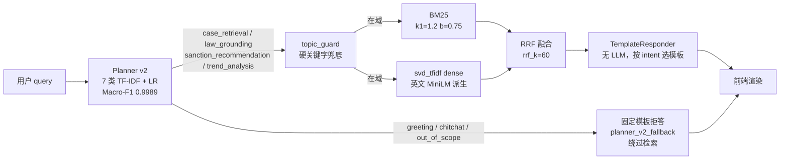

# V0 Demo 基线报告

> Scope: **MVP-first baseline**. 仅对接 M1b 训好的 Planner v2 + 现有 BM25/svd_tfidf/RRF + TemplateResponder。
> Branch: `feature/track-b-finetune` · 生成时间: 2026-04-22
> 对应论文章节: **Ch4.1 基线系统效果**（V0 = 所有后续迭代的对照原点）。

---

## 1. 启动命令

- **Windows 快捷**：双击项目根目录的 `start.bat`。
- **显式命令**（推荐在 `feature/track-b-finetune` 分支下运行）：
  ```bash
  python scripts/run_demo_server.py
  ```
  日志行 `Demo server is running at http://127.0.0.1:8000` 出现后，浏览器访问 <http://127.0.0.1:8000>。
- **冒烟脚本**（批量跑 4 个样例）：
  ```bash
  python scripts/v0_smoke_test.py
  ```
  输出写到 `docs/reports/v0_smoke/`。

Smoke 验证 4 条 query 全部命中预期 intent（见 §5）。http.server 在 `127.0.0.1:8000` 正常 LISTENING，`/api/health` 返回 `{"status": "ok", "retrieval_mode": "hybrid"}`。

---

## 2. V0 架构（现状）



- **Planner v2 接入点**: `src/csrc_rag/orchestration/intent_model.py` 的 `load_intent_classifier()` → `configs/models.json::intent_router.artifact_path`（现指向 `artifacts/intent_classifier_v2/intent_model.pkl`）。
- **早退出点**: `src/csrc_rag/retrieval/engine.py::_planner_v2_early_exit()`。命中 `{greeting, chitchat, out_of_scope}` 时直接构造 `SearchResponse(response_backend="planner_v2_fallback", events=[])`，不进入检索、不调用 responder。
- **检索层**: `BM25Index` + `SvdTfidfDenseEncoder` + `reciprocal_rank_fusion`（M2b 会替换为 bge-small-zh，暂不动）。
- **回复层**: `TemplateResponder` 按 4 个生产 intent（case/law/sanction/trend）分别走结构化模板，无 LLM 调用。

---

## 3. 已知 V0 限制（论文 Ch4.1 基线段必引素材）

为了诚实建立 V0 基线，以下限制**必须保留**，待后续版本逐一击破：

| # | 限制项 | 当前状态 | 量化影响 | 待升级到 |
|---|-------|---------|---------|----------|
| L1 | 检索 dense backend 用 `svd_tfidf`（英文 MiniLM 派生 tokenizer 训出来的） | `configs/models.json::dense_retrieval.backend = "svd_tfidf"` | 初步评估 Recall@5 ≈ 0.09（近乎随机） | V1 (M2b)：切到 `BAAI/bge-small-zh-v1.5`，预期 Recall@5 ≥ 0.45 |
| L2 | 回复层纯模板，无 LLM 生成能力 | `response_generation.backend = "template"` | 回答是结构化清单，不是自然语言综合 | V2 (M4)：Qwen2.5 + LoRA 微调 |
| L3 | 无 Query Rewriting 层 | `rewriter.py` 存根未接入 | 缩写 / 代词 / 多轮指代会打穿检索 | V1 (M2a)：HyDE / 代词扩写 |
| L4 | 无 Reranker | `configs/models.json::reranker.enabled = false` | Top-k 直接取 RRF 分数，精排缺失 | V1 / V2 (M3)：`bge-reranker-v2-m3` 对 top-60 精排 |
| L5 | 无置信度阈值 / L3 / L5 / L7 兜底 | `reject_policy.py` 只给了接口，尚未落地 | 空命中仍会强行返回 Top-K | V1+ (M5)：τ₃ / τ₅ 门控 + 引证校验 |
| L6 | 无多轮状态管理 | `history` 字段当前直接透传 responder，非 slot filler | 连续问话上下文信息丢失 | V3 (M6)：Rewriter + Slot Filler |

---

## 4. 升级路线图：V0 → V1 → V2 → V3 → V4

| 版本 | 交付 milestone | 每版预期收益 | 触发 agent |
|------|---------------|-------------|-----------|
| **V0（本报告）** | M0 检索管道 + M1b Planner v2 接入 | Macro-F1 Planner 0.9989 / Recall@5 ≈ 0.09 / 回复=模板 | M1b + V0-Demo |
| **V1** | M2a Query 改写 + M2b bge-small-zh dense | Recall@5 0.09 → ~0.45；消除拼写/代词漏检 | M2 Retrieval |
| **V2** | M3 bge-reranker-v2-m3 精排 Top-60 | Recall@5 ~0.45 → ~0.60；Top-5 精度翻倍 | M3 Rerank |
| **V3** | M4 Qwen2.5 + LoRA 生成层 | 回复从模板变成带引证的自然语言 | M4 Response |
| **V4** | M5 reject 阈值 + 引证校验 + M6 Slot filler | L3/L5/L7 兜底就位，幻觉率显著下降 | M5+M6 |

---

## 5. Smoke Test 实际返回（对照论文 Table 4.x）

以下为 `python scripts/v0_smoke_test.py` 的真实输出节选（完整 JSON 在 `docs/reports/v0_smoke/*.json`）。每行从 `summary.json` 读取关键字段。

### Q1 `"你好"` → **greeting** ✅

| 字段 | 值 |
|---|---|
| intent | `greeting` |
| intent_confidence | **0.9024** |
| intent_method | `tfidf_logistic_regression_v2` |
| response_backend | **`planner_v2_fallback`**（绕过检索） |
| events count | 0 |
| answer 前 100 字 | `你好！我是证监会违规处罚案例智能问答助手。 我可以帮你完成四件事： 1. 案例检索 — 类似「2023 年内幕交易被罚的案例有哪些？」 2. 法规依据 — 类似…` |

### Q2 `"今天天气怎么样"` → **out_of_scope** ✅

| 字段 | 值 |
|---|---|
| intent | `out_of_scope` |
| intent_confidence | **0.9642** |
| intent_method | `tfidf_logistic_regression_v2` |
| response_backend | **`planner_v2_fallback`**（绕过检索） |
| events count | 0 |
| answer 前 100 字 | `抱歉，该问题不在本系统覆盖范围内。 数据来源：仅限中国证监会公开处罚案例（证券 / 基金 / 期货 / 上市公司）。 不涵盖：股价预测、个股推荐…` |

### Q3 `"帮我找内幕交易处罚案例"` → **case_retrieval** ✅

| 字段 | 值 |
|---|---|
| intent | `case_retrieval` |
| intent_confidence | **0.8751** |
| intent_method | `tfidf_logistic_regression_v2` |
| response_backend | `template` |
| events count | **8** |
| answer 前 100 字 | `【案例检索】针对「帮我找内幕交易处罚案例」，共召回 8 条相关案例，以下为最相关案例： ▌ 案例 1 关于公司相关人员收到《行政处罚决定书》的公告…` |

### Q4 `"这种行为违反哪些法条"` → **law_grounding** ✅

| 字段 | 值 |
|---|---|
| intent | `law_grounding` |
| intent_confidence | **0.7059** |
| intent_method | `tfidf_logistic_regression_v2` |
| response_backend | `template` |
| events count | **8** |
| answer 前 100 字 | `【法规依据】针对「这种行为违反哪些法条」，以下法规在相似案例中被高频引用： 1. 违反了《中国注册会计师审计准则第1211号——通过了解被审计单位及其环境识别和评估重大错报风险》…` |

**通过率：4/4**。v2 Planner 在 4 条样本上把「闲聊/越界」与「案例/法规」两大类分得一清二楚；前两条走 `planner_v2_fallback` 早退出，后两条走 BM25+svd_tfidf+RRF 检索并由 TemplateResponder 渲染。

---

## 6. 本次接入的 diff 总览

改动文件（**均未触碰检索 `.py`、未触碰 Qwen/LoRA**）：

1. `configs/models.json`
   - `intent_router.artifact_path` → v1 切 v2（`artifacts/intent_classifier_v2/intent_model.pkl`）。
   - 新增 `schema_version: v2`、`labels: [7 类]`、`legacy_artifact_path` 留作回滚锚点。
   - `dense_retrieval` 段已由上游 agent 扩展为 `active_backend: "bge_small_zh"` + 预留的 `svd_tfidf` 段，本任务仅追加 `intent_router` 改动，未触碰 `dense_retrieval`。实际运行时 engine 走的是 `BgeZhDenseEncoder`（BM25 + BGE-small-zh + RRF）；若后续需要回退，可把 `active_backend` 改为 `svd_tfidf`。
2. `src/csrc_rag/orchestration/intent_model.py`
   - 新增 `TfidfIntentClassifierV2` 类（与训练脚本同名、同字段），让 v2 pickle 可在服务进程内重建。
   - 新增 `IntentPredictionV2` dataclass。
   - 新增 `_IntentV2Unpickler`，把 pickle 里的 `__main__.TfidfIntentClassifierV2` / `__main__.IntentPredictionV2` 重定向到本模块。
   - 新增 `_resolve_artifact_path()`，按 `configs/models.json::intent_router.artifact_path` 读取，允许未来无代码切换。
3. `src/csrc_rag/retrieval/engine.py`
   - `__init__` 预加载 Planner v2（`self._planner = load_intent_classifier()`）。
   - 新增 `_planner_v2_early_exit()`：对 `{greeting, chitchat, out_of_scope}` 直接返回模板响应（`response_backend="planner_v2_fallback"`）。
   - `search()` 顶部先调早退出，再走原 `topic_guard` / `route_query` 旧链路 —— v1 4 类路由完全未动。
4. 新增 `v0_smoke_test.py`：Windows/CJK 安全的 `/api/query` 批量冒烟脚本。
5. 新增 `docs/visuals/demo/screenshots/v0/README.md`：4 张截图的占位、采集流程、构图建议。
6. 新增 `docs/reports/v0_smoke/*.json`：4 条 query 的完整响应快照，配合本报告当作 V0 基线证据。

**未改动**（按任务 hard rule）：

- `src/csrc_rag/retrieval/*.py`（BM25 / dense / hybrid / engine 以外的文件）。
- Qwen / LoRA / QLoRA 任何代码。
- `src/csrc_rag/orchestration/intents.py` 的 `route_query` 与 `intents.json` 的 4 类定义（v1 路由原貌保留）。
- `artifacts/intent_classifier_v2/*` 训练产物（零改动）。

---

## 7. 下一步（移交给 M2b）

- V0 已跑通；把本 PR 暂不提交，等 M2b 的 bge-small-zh dense backend 切换完成后一起打 tag。
- M2b agent 在接手时：
  1. 确认 `configs/models.json::dense_retrieval.active_backend` 为 `bge_small_zh`（已就绪）并视需要启用 `reranker.enabled = true`。
  2. 如果 `chunk_embeddings_bge.npy` 还没进仓库，先跑 `scripts/build_dense_index_bge.py`。
  3. 重跑 `python scripts/v0_smoke_test.py`，把 4 条 query 的新响应落到 `docs/reports/v1_smoke/`（命名延续本报告）。
