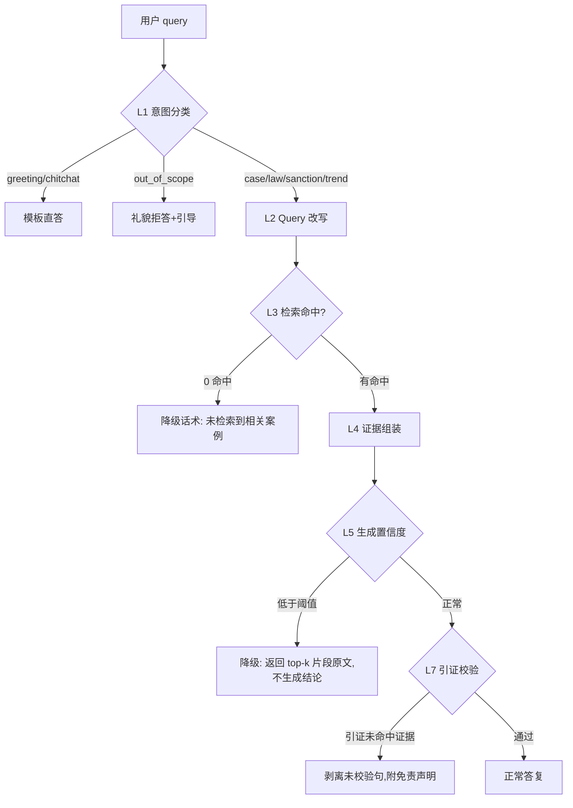

# 01 拒答策略（Reject Policy）

> Owner: 团队成员（拒答策略） · 位置: L1 意图识别 + L3/L5/L7 多级兜底
> 上游: 用户原始 query → topic_guard → intent_model
> 下游: L2 Query 改写 / L3 检索 / responder 模板

## 1. 策略目标

在证监会违规案例 RAG 系统里，拦住"不该答"和"答不好"的请求，同时保持礼貌与引导性。核心目标：
- **拦住越界**：非证券类问题直接拒答，不进入昂贵的检索+生成链路。
- **拦住幻觉**：检索空/生成置信度低/引证不过时，降级为"没查到"，不强行编造。
- **保留善意**：招呼、闲聊、轻度越界走友好引导，不一刀切返回"超出范围"。

## 2. 意图 7 类体系

| # | intent | 定义 | 典型样本 | 触发动作 |
|---|--------|------|----------|----------|
| 1 | `greeting` | 打招呼/问候 | "你好" "在吗" "hi" | 模板回复 + 能力介绍 |
| 2 | `chitchat` | 无信息需求的闲聊 | "你是谁" "写首诗" "今天累了" | 礼貌拒答 + 引导 |
| 3 | `out_of_scope` | 明确越界（天气/医疗/编程/保险等非证券金融） | "明天北京天气" "保险公司违规处罚" | 说明边界 + 引导 |
| 4 | `case_retrieval` | 案例检索（主力） | "2023 年内幕交易被罚的案例" | L2→L3→L4→L5 全链路 |
| 5 | `law_grounding` | 法规依据查询 | "证券法第 193 条适用情形" | 偏 BM25 + 法规库检索 |
| 6 | `sanction_recommendation` | 处罚建议/类案推理 | "类似行为一般如何处罚" | 类案检索 + 生成 |
| 7 | `trend_analysis` | 趋势统计 | "近 5 年信披违规数量变化" | L6 趋势层 + 聚合 |

## 3. 越界边界界定

**领域内（in-scope）** = 证监会处罚范围 ∪ 证券市场违规 ∪ 上市公司/基金/期货/债券相关违规。判断三道门：
1. `_BLOCKLIST_TOKENS` 命中 → 直接越界。
2. query 长度 > 阈值且无任何 `_DOMAIN_TOKENS` → 可疑越界。
3. 命中"金融近邻词"但非证券域（保险、银行信贷、外汇管制） → **软越界**，返回 `out_of_scope` 但话术区分：告诉用户"这是金融但不是我能答的那种"。

**金融类但非证券问题**（如保险违规、银保监处罚）→ **算越界**。理由：数据源只来自证监会 14,740 行处罚表，保险业务由原银保监主管，检索会命中 0 条，强行生成必幻觉。

## 4. 多级兜底（L1/L3/L5/L7）



| 级别 | 触发条件 | 降级动作 | 返回给用户的话术 key |
|------|---------|---------|---------------------|
| **L1** | intent ∈ {greeting, chitchat, out_of_scope} | 不进入检索，直接模板 | `tpl_greeting` / `tpl_chitchat` / `tpl_out_of_scope` |
| **L3** | 检索 top-k 全部分数 < τ₃ 或 0 命中 | 返回"未检索到相关案例"，建议换关键词 | `tpl_no_hit` |
| **L5** | 生成置信度 < τ₅ 或 max_logprob 过低 | 不给结论，只返回检索到的片段 | `tpl_low_confidence` |
| **L7** | 引证校验（生成中的案号/法条未在证据里出现）失败 | 剥离未校验句，加"以下未经证据核验"免责条款 | `tpl_citation_fail` |

τ₃、τ₅ 放 `configs/reject.yaml` 可调，默认 τ₃=0.25（RRF 归一分），τ₅=0.35（logprob 平均）。

## 5. 礼貌话术模板

- `tpl_greeting`：「你好！我是证监会违规案例智能问答助手，可以帮你检索案例、查询法规依据、分析处罚趋势。试试问我：『2023 年内幕交易案例有哪些』」
- `tpl_chitchat`：「这个问题有点超出我的专长。我专注于证券违规案例检索、法规依据、处罚分析和趋势统计。要不要从这几个方向提问？」
- `tpl_out_of_scope`（硬越界）：「该问题不在证监会处罚案例范围内。本系统仅覆盖：证券违规案例检索 / 法规依据查询 / 处罚推荐 / 趋势分析。」
- `tpl_out_of_scope_finance`（金融近邻）：「这是金融相关问题，但本系统数据仅覆盖证监会（证券/基金/期货/上市公司）处罚案例，不含银保监/外管局数据。建议到对应机构官网查询。」
- `tpl_no_hit`：「未检索到与『{query}』直接相关的案例。可以尝试：① 补充年份/当事人/违规类型关键词；② 用更具体的法条编号；③ 改写为案件类型（如『信息披露违规』）。」
- `tpl_low_confidence`：「相关案例检索到 N 条，但置信度不足以给出综合结论。以下为原文片段供参考：…」
- `tpl_citation_fail`：「答复已生成，但部分引证未通过自动校验。以下内容仅供参考，请以原文为准：…」

## 6. topic_guard.py 修订建议（不动文件，提给下游合并）

现状痛点：
1. **短 query 豁免门槛 6 字符** → "你好"(2字) 走豁免放过，但"写首诗"(3字) 也会豁免 → 看似一致，**但真正被"阻拦"的是"写首诗"触发 LLM 后没有命中领域词**，**不是** topic_guard 拦的。需澄清责任分层。
2. **缺少金融近邻词白黑名单**：保险/银行信贷等目前没进 BLOCKLIST，也不在 DOMAIN → 走长 query 无领域词分支被拒。话术不区分。

建议（本策略实现不动 topic_guard.py，由 reject_policy 二次分类）：
- topic_guard 保持"粗筛"职责：硬黑名单命中 + 长 query 无领域词 → out_of_scope。
- reject_policy 做"细分类"：在 topic_guard 结果之上，加 greeting / chitchat / finance_adjacent 三个子类判断（短词 + 寒暄词表 + 金融近邻词表），映射到不同话术。
- 关键词表不新增黑名单词（避免误伤"保险基金"等合规表述）；在 reject_policy 里引入 `_FINANCE_ADJACENT_TOKENS = {"保险","银行","信贷","外汇","央行","银保监"}`，命中后走 `tpl_out_of_scope_finance`。

## 7. 接口 JSON Schema

```json
{
  "$id": "IntentDecision",
  "type": "object",
  "required": ["intent", "action", "confidence"],
  "properties": {
    "intent": {
      "type": "string",
      "enum": ["greeting", "chitchat", "out_of_scope",
               "case_retrieval", "law_grounding",
               "sanction_recommendation", "trend_analysis"]
    },
    "action": {
      "type": "string",
      "enum": ["answer_template", "proceed_pipeline",
               "fallback_no_hit", "fallback_low_conf", "fallback_citation"]
    },
    "confidence": {"type": "number", "minimum": 0, "maximum": 1},
    "fallback_message": {"type": ["string", "null"]},
    "fallback_level": {
      "type": ["string", "null"],
      "enum": [null, "L1", "L3", "L5", "L7"]
    },
    "hint_examples": {
      "type": "array",
      "items": {"type": "string"}
    }
  }
}
```

## 8. 评估指标

| 指标 | 目标 |
|------|------|
| 越界召回率 (out-of-scope recall) | ≥ 0.95 |
| 越界误伤率 (in-scope false reject) | ≤ 0.05 |
| greeting / chitchat 正确识别率 | ≥ 0.90 |
| L3 空命中识别准确率 | ≥ 0.98 |
| L7 引证校验命中率（抽样 100） | ≥ 0.90 |

评测集：构造 200 条 balanced query（7 类各 ~28 条 + 对抗样本）。

## 9. 风险与兜底

- **风险 1**：意图分类器置信度过低 → fallback 到 topic_guard + 规则。
- **风险 2**：用户中英混合/拼音 query → 规则先失败，交给 intent_model。
- **风险 3**：L5 置信度阈值过严导致好答案被降级 → 配置化 τ，离线调参。
- **兜底**：所有降级路径必须给出 ≥1 条"建议提问方向"，绝不返回空字符串。
