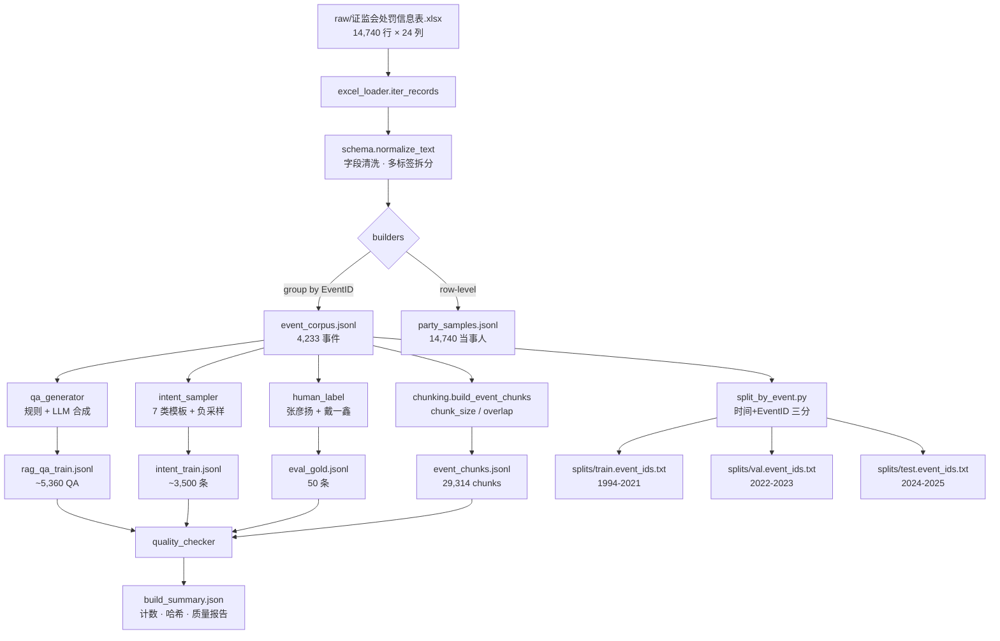

# 02 · 数据处理策略（团队成员）

> 负责范围：原始 Excel → 六份衍生数据集 的完整流水线、切分规则、质量规范、数据口径与 chunk 策略再评估。
> 上下游：下游服务 L1（意图识别，戴一鑫）/ L2（Query 改写）/ L3（检索，贾彤）/ L5（LoRA 微调，王怡菲） / 评估（全员）。
> 约束：不泄漏 `PunishmentMeasure` 字段；按 EventID + 时间三分；所有衍生集统一列入 `data/processed/` 并生成 `build_summary.json`。

---

## 1. 策略目标

1. 把 14,740 行、24 列的原始 Excel 稳定地转化为**可复现、可追溯、可切分**的六类衍生数据集，供意图、检索、生成、评估四条链路直接消费。
2. 建立**单一事实来源（SoT）**：所有下游 Agent 只从 `data/processed/*.jsonl` 读取，不再直接触碰 Excel。
3. 严守两条红线：
   - **PunishmentMeasure 不进入任何模型输入**（会泄漏"决定"字段）。
   - **按 EventID + 时间**做 Train/Val/Test 切分，避免同一事件多当事人行跨集导致的泄漏。

## 2. 输入 / 输出

**输入**
- `data/raw/证监会处罚信息表.xlsx`（14,740 行 × 24 列，CSMAR 口径）
- `config/retrieval.json`（chunk_size、overlap 等）

**输出（`data/processed/`）**

| 文件 | 数量 | 用途 | 状态 |
|---|---|---|---|
| `event_corpus.jsonl` | 4,233 | 事件级检索/摘要文档 | ✅ 已存在 |
| `event_chunks.jsonl` | 29,314 | 片段级检索索引 | ✅ 已存在 |
| `party_samples.jsonl` | 14,740 | 分类训练样本（当事人级） | ✅ 已存在 |
| `rag_qa_train.jsonl` | ~5,360 | LoRA SFT QA 对 | 🆕 本轮造 |
| `intent_train.jsonl` | ~3,500 | 7 类意图训练 | 🆕 本轮造 |
| `eval_gold.jsonl` | 50 | 人工评测集 | 🆕 手工标 |
| `splits/{train,val,test}.event_ids.txt` | 3 份 | EventID 白名单 | 🆕 由切分脚本生成 |
| `build_summary.json` | 1 | 计数与哈希 | ✅ 扩展字段 |

## 3. 端到端流水线（mermaid）



## 4. 切分规则（`split_by_event.py` 规格）

**主键**：`EventID`（事件 ID）。同一 EventID 的所有当事人/chunk 必须在同一 split。

**时间基准**：优先取 `SupervisionDate`，缺失时回退到 `DeclareDate`，再缺失进入 `unknown` 桶。

**切分边界**：
- `train`：年份 ∈ [1994, 2021]
- `val`：年份 ∈ [2022, 2023]
- `test`：年份 ∈ [2024, 2025]
- `unknown`：缺日期事件 → 默认进 `train`，并在 `build_summary.json` 里单独计数、打 warning。

**输出**：`data/processed/splits/{train,val,test,unknown}.event_ids.txt`（每行一个 EventID），以及派生的 `*.party_ids.txt` / `*.chunk_ids.txt`。

**调用约定**：所有下游消费者（检索评估、LoRA 数据加载、意图训练）通过
```python
from csrc_rag.data.splits import load_split
event_ids = load_split("train")  # set[str]
```
加载，不得自行切分。

## 5. 数据质量 checklist

### 5.1 清洗（对应 `quality_checker.py`）
- [ ] 所有字符串字段执行 `normalize_text`（去 NBSP、全半角统一、strip）。
- [ ] `DeclareDate` / `SupervisionDate` 标准化为 `YYYY-MM-DD`，非法日期 → `null` 并记录。
- [ ] `SumPenalty` 统一单位（万元 → 元），负值/超过 10 亿的离群值进入 `outliers.jsonl`。
- [ ] `IsListedCom` 归一化为 `{"0", "1", null}`。
- [ ] `Symbol` 保留 6 位股票代码，非法剔除。
- [ ] **`PunishmentMeasure` 从 `retrieval_text` / `input_text` 中剔除**（只进 `reference_text`，仅评估用）。
- [ ] `ViolationType` / `PunishmentType` 多标签拆分并排序稳定。

### 5.2 去重
- [ ] `event_corpus`：同一 EventID 多行 → group by 合并（已实现）。
- [ ] `event_chunks`：同一 (event_id, chunk_index) 唯一。
- [ ] `rag_qa_train`：(question, answer) MinHash-LSH 近似去重，阈值 Jaccard ≥ 0.9。
- [ ] `intent_train`：(text, intent) 完全去重 + 类内近似去重。

### 5.3 异常与截断
- [ ] 单 chunk 超过 512 token 时记 warning，截断到 `chunk_size`（默认 384）。
- [ ] `activity` / `law` 超过 4,000 字符时截断尾部并打标 `truncated=true`。
- [ ] 全空字段行（event_id 外全为空）→ 丢弃并计数。

### 5.4 反泄漏
- [ ] `rag_qa_train` 的 `context` 来自的 EventID 必须属于 `train` split。
- [ ] `intent_train` 不得直接拷贝 `eval_gold` 的 query。
- [ ] 生成数据集前先调 `assert_no_leakage(splits)`。

## 6. 数据口径统一（论文写法）

开题报告承诺「14,743 去重后 ~8,000 条有效」，实际执行口径为 **14,740 行 → 4,233 事件 + 14,740 当事人样本**。论文统一写法：

> 原始 CSMAR 证监会处罚信息表共 14,740 条行记录（开题报告 14,743 为表头计数偏差，修订为 14,740）。本研究以 **EventID** 为最小事件单位，聚合后得到 **4,233 个事件级文档**；同时以当事人为粒度保留 **14,740 条分类样本**。"8,000 有效"为开题阶段估算，实际采用按 EventID 去重后事件数（4,233）作为检索语料规模、14,740 作为监督学习样本规模。

并在论文"数据集"小节加一张口径映射表：

| 口径 | 数量 | 含义 | 用途 |
|---|---|---|---|
| 原始行 | 14,740 | Excel 一行一当事人 | 溯源 |
| 当事人样本 | 14,740 | row-level | 意图/分类/LoRA SFT |
| 事件文档 | 4,233 | EventID group | 检索主键 |
| 事件 chunks | 29,314 | 片段级 | 检索索引 |

## 7. chunk 策略再评估

**现状**：`event_chunks.jsonl` 采用固定窗口（chunk_size=384, overlap=64），29,314 片段。

**评估结论**：**保留事件级 chunking 作为主索引，但新增一级"事件摘要"索引**，形成**两级索引**：

| 层级 | 粒度 | 字段 | 数量 | 用途 |
|---|---|---|---|---|
| L-A 摘要层 | 事件 | `event_corpus.retrieval_text` | 4,233 | 粗召回、趋势分析、拒答判断 |
| L-B 片段层 | chunk | `event_chunks.text` | 29,314 | 细粒度证据、句子级引证 |

检索流程：先 BM25+Dense 在 L-A 做粗召回取 Top-K=20 → 对应事件扩展到 L-B → reranker 在 L-B 输出 Top-N=5。这样既保留事件完整语义（有利于 `trend_analysis`），又不丢失细粒度证据（有利于 `law_grounding`）。

**超参建议**：chunk_size 可从 384 再跑两组对照（256/512），val 集 nDCG@10 取最优，结果写进消融章节。

## 8. 接口约定（JSON schema）

### 8.1 `rag_qa_train.jsonl`
```jsonc
{
  "qa_id": "ev000123-q01",
  "event_id": "000123",
  "intent": "case_retrieval",        // 7 类之一
  "question": "2019 年某公司信息披露违规案例？",
  "context": "标题：...\n违规行为：...",   // 来自 retrieval_text，≤ 2000 字
  "answer": "依据…，该公司…",          // 含引证标记 [EventID:000123]
  "evidence_event_ids": ["000123"],
  "split": "train",
  "source": "rule|llm|manual"
}
```

### 8.2 `intent_train.jsonl`
```jsonc
{
  "id": "int-00001",
  "text": "帮我查一下 2023 年信息披露违规",
  "intent": "case_retrieval",
  "slots": {"year": "2023", "violation_type": "信息披露"},
  "split": "train",
  "source": "template|paraphrase|manual"
}
```

### 8.3 `eval_gold.jsonl`
```jsonc
{
  "eid": "gold-001",
  "question": "...",
  "intent": "law_grounding",
  "expected_event_ids": ["000123", "000456"],
  "expected_laws": ["证券法第193条"],
  "expected_answer_key_points": ["...", "..."],
  "split": "test",
  "annotator": "zhangyanyang"
}
```

### 8.4 `splits/*.event_ids.txt`
```
000001
000003
000042
```

## 9. 评估指标

- **覆盖率**：每个 split 的事件数、当事人数、chunk 数、意图类别分布。
- **泄漏检查**：`val`/`test` EventID 与 `train` 交集必须为空。
- **长度分布**：chunk token 长度 p50/p95/p99。
- **质量抽检**：随机抽 200 条 `rag_qa_train` 人工判断「问题-答案-证据」三元组一致性 ≥ 90%。

## 10. 风险与兜底

| 风险 | 兜底 |
|---|---|
| 2024-2025 test 集事件过少 | 允许 val/test 边界下移到 2022 / 2023-2025，先看分布再定 |
| 日期字段缺失 > 10% | 缺失事件默认进 train，并在论文「局限性」章节说明 |
| LLM 合成 QA 含幻觉 | 强证据约束 prompt + `evidence_event_ids` 强制存在 + 人工抽检拒收率 |
| chunk 过小导致上下文断裂 | 两级索引（摘要 + 片段）兜底 |
| PunishmentMeasure 意外回流 | `quality_checker` 显式断言 `retrieval_text` 不含该字段 |

---

**代码交付**：
- `scripts/split_by_event.py`（切分脚本骨架）
- `src/csrc_rag/data/quality_checker.py`（质量检查器骨架）

两个文件只含签名、docstring、TODO，不覆盖他人实现；后续由本 agent 迭代填充。
