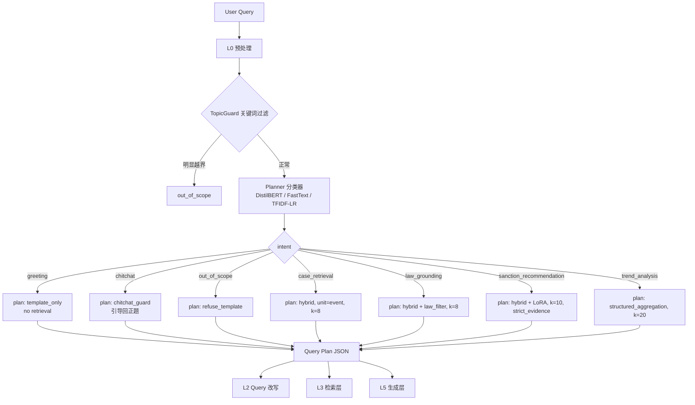

# 04 · Planner 规划器训练策略（团队成员）

> Owner: 团队成员 · 上游：L0 预处理 · 下游：L2 Query 改写 + L3 检索 + L5 生成
>
> 参见 [策略总览.md](./策略总览.md)

## 1. 策略目标

把当前 **TF-IDF + LogisticRegression 的 4 类意图分类器**升级为 **7 类「查询路径规划器（Query Planner）」**：不仅输出 `intent`，还输出下游 L2~L5 所需的完整 **query plan**（`retrieval_mode / filters / top_k / response_template`）。同时给出三条训练路线（TF-IDF+LR / FastText / DistilBERT）的对照评估口径，选定主路线并留出升级通道。

7 个意图（与共享上下文一致）：

| # | intent | 说明 | 典型下游行为 |
|---|---|---|---|
| 1 | `greeting` | 问候、开场 | 走模板回复，不检索 |
| 2 | `chitchat` | 闲聊 / 寒暄 | 走拒答 + 话题引导 |
| 3 | `out_of_scope` | 与证监会处罚无关 | TopicGuard 拦截 |
| 4 | `case_retrieval` | 相似案例检索 | hybrid 检索 event，top_k=8 |
| 5 | `law_grounding` | 法条依据 | hybrid 检索 + 法条字段过滤 |
| 6 | `sanction_recommendation` | 处罚推荐 | 检索 + LoRA 生成 + 强证据约束 |
| 7 | `trend_analysis` | 趋势统计 | 走结构化 SQL/聚合而非向量检索 |

## 2. 输入 / 输出

### 输入
```json
{"query": "帮我找近两年内幕交易类似案例", "dialog_history": [...]}
```

### 输出（query plan，给 L2~L5 共用）
```json
{
  "intent": "case_retrieval",
  "confidence": 0.93,
  "retrieval_mode": "hybrid",
  "filters": {"year_range": [2023, 2025], "violation_type": "内幕交易"},
  "top_k": 8,
  "response_template": "similar_cases_v2",
  "need_generation": false,
  "rewrite_hint": "need_coref_resolution"
}
```

## 3. 7 类意图流程（mermaid）



## 4. 种子数据构造（7 类 × 每类 3 条，共 21 条）

> 完整版 30 条/类放在 `configs/intent_examples_v2.json`，这里仅列代表性 3 条。

| intent | 示例 1 | 示例 2 | 示例 3 |
|---|---|---|---|
| `greeting` | 你好 | hi，在吗 | 早上好，帮我一下 |
| `chitchat` | 你是谁开发的 | 今天天气怎么样 | 讲个笑话吧 |
| `out_of_scope` | 给我推荐一部电影 | 帮我写 Python 冒泡排序 | 明天股票能涨吗 |
| `case_retrieval` | 帮我找和内幕交易类似的处罚案例 | 历史上有没有和这类行为相近的案件 | 召回和操纵市场接近的历史案例 |
| `law_grounding` | 这类行为通常违反哪些法条 | 请给出相关法律依据并列条款 | 对应《证券法》哪一条 |
| `sanction_recommendation` | 结合案例给出处罚建议 | 这种情况更可能警告还是罚款 | 预测一下可能对应哪些处罚 |
| `trend_analysis` | 近五年内幕交易处罚趋势如何 | 统计不同年份的处罚方式变化 | 信息披露违规的分布有什么变化 |

## 5. LLM 扩增：30 → 500 条/类

### 通用扩增 Prompt（复用，替换 `{intent}` 与 `{seeds}`）

```
你是一个中文语料扩增器。以下是「{intent}」意图的 30 条种子样本，语义范围是：{intent_description}。

【任务】生成 470 条新样本，与种子语义一致但表达多样化，要求：
1. 保持意图类别「{intent}」不变，不能跨类；
2. 句式多样：陈述句 / 疑问句 / 祈使句 / 省略句各占一定比例；
3. 词汇多样：同义替换（处罚↔罚则↔制裁）、称呼变换（请/帮我/麻烦/能否）、口语/书面语混合；
4. 长度多样：5~40 字区间均匀分布；
5. 领域术语准确：若涉及「内幕交易 / 信息披露违规 / 操纵市场 / 短线交易 / 财务造假」等，保持证监会处罚领域术语准确；
6. 不能出现 PunishmentMeasure 具体结果（防数据泄漏）；
7. 不能出现真实人名、机构名、股票代码；
8. 输出 JSON 数组，每条一个字符串。

【种子】
{seeds}

【输出】JSON array, 470 items.
```

### 类别特异性附加约束

| intent | 额外约束 |
|---|---|
| `greeting` | 仅寒暄/打招呼，禁止出现任何业务词 |
| `chitchat` | 可涉及 AI / 项目 / 天气 / 情绪，禁止出现「处罚 / 法条 / 案例」 |
| `out_of_scope` | 明显跨领域：娱乐、编程、健康、股票预测、财经分析以外 |
| `case_retrieval` | 必须含相似性意图词（类似、相近、近似、参考、相关） |
| `law_grounding` | 必须含法律依据意图词（法条、法规、条款、依据、违反） |
| `sanction_recommendation` | 必须含推荐动作（建议、推荐、判断、预测、结论） |
| `trend_analysis` | 必须含时间/统计词（近几年、趋势、分布、变化、统计） |

### 扩增后处理

1. **去重**：char-level 4-gram Jaccard > 0.85 去重；
2. **人工抽检**：每类抽 30 条（6%）由 项目统筹 复核标签；
3. **边界注入**：每类额外加 20 条「易混样本」（如 `case_retrieval` vs `law_grounding` 的边界样本），人工标注；
4. **切分**：Train / Val / Test = 7 / 1.5 / 1.5，按 hash(text) 切分防泄漏。

## 6. 三条训练路线对比

| 维度 | TF-IDF + LR（当前 baseline） | FastText (zh subword) | DistilBERT-zh / MiniLM-zh |
|---|---|---|---|
| 模型大小 | < 1 MB | 30-150 MB | 120-250 MB |
| 推理延迟 (CPU) | < 1 ms | 1-3 ms | 15-40 ms |
| 预期 Macro-F1 | 0.85~0.90 | 0.90~0.93 | **0.94~0.97** |
| 短 query (≤5 字) | 中（char n-gram 够用） | 好（subword） | **好** |
| OOV / 口语 | 弱 | 中 | **强** |
| 训练时间 (CPU) | < 10 s | < 30 s | 5-15 min |
| 依赖 | sklearn（已装） | fasttext（pip） | transformers（已装） |
| LoRA 兼容 | 无关 | 无关 | 可选 LoRA 微调头 |
| 可解释性 | **高**（看 coef） | 中 | 低 |
| 维护成本 | **低** | 低 | 中 |
| 适合 greeting/chitchat 短句 | 中 | **好** | 好 |

### 选型建议（分阶段）

1. **阶段 1（当周）**：TF-IDF + LR 升级到 7 类，作为线上 fallback（<1ms 响应、可解释、无新依赖）。
2. **阶段 2（答辩前）**：训练 FastText 作为主路线（准确率提升 + 依然 CPU 友好）。
3. **阶段 3（消融 / 加分项）**：训练 DistilBERT-zh 作为"高配版"，跟 TF-IDF 做对比写进论文（刚好凑 baseline 消融 ≥ 5 组的其中一组）。

本仓库提供的 `scripts/train_intent_classifier_v2.py` 默认训练路线 1，保留 `--backend fasttext|bert` 钩子。

## 7. Query Plan Schema：是否让 Planner 做完整规划

**结论：做。** 单独"意图分类"太窄；在 RAG 场景下，downstream 必需的 4 个字段（`retrieval_mode / filters / top_k / response_template`）与 intent 高度耦合，合并输出能：

- 避免下游各模块重复写规则；
- 形成明确的 JSON 接口契约，前后端可 mock；
- 为将来换成 LLM-based Planner（function calling）预留结构。

实现：`intent` 由分类器预测，其余字段走 **配置驱动**（读 `configs/intents.json`），不是同一个模型输出——训练成本低、可审计。

```python
from dataclasses import dataclass

@dataclass(frozen=True)
class QueryPlan:
    intent: str
    confidence: float
    retrieval_mode: str           # "none" | "hybrid" | "structured_aggregation"
    filters: dict[str, object]
    top_k: int
    response_template: str
    need_generation: bool
    rewrite_hint: str | None
```

## 8. 多轮 Dialog State Tracking（DST）

**结论：本项目阶段 1 不做完整 DST，阶段 2 仅做"轻量对话状态"。**

| 方案 | 推荐度 | 理由 |
|---|---|---|
| 完整 DST（slot-filling + 状态机） | ❌ | 与赛道 B 交付物不相关，投入产出比低 |
| **轻量 DST（last_intent + last_entities 滑窗）** | ✅ | 够 demo 用，10 行代码，足以支持"那上一个案例呢" 这类 follow-up |
| LLM-based DST（把 history 塞 prompt） | 🟡 | 在 L2 Query 改写里做（共指消解），不要重复做 |

**落地**：在 `orchestration` 层加 `DialogSession(last_intent, last_query, last_entities: dict)`，Planner 在分类时把 `last_intent` 作为额外特征（one-hot 拼进 TF-IDF vector）；单轮时为空向量，不影响单轮准确率。

## 9. 评估指标

| 指标 | 目标 |
|---|---|
| Macro-F1 (7 类) | ≥ 0.92（FastText 主路线） |
| Per-class Recall | 每类 ≥ 0.88，`out_of_scope` ≥ 0.95（必须高召回） |
| 边界混淆率 | `case_retrieval` vs `law_grounding` ≤ 5% |
| 线上延迟 (P95) | ≤ 5 ms (CPU) |
| OOS 误拒率 | 合规 query 被判为 `out_of_scope` ≤ 2% |

## 10. 风险与兜底

| 风险 | 兜底 |
|---|---|
| LLM 扩增样本噪声大 | 人工抽检 6% + 边界样本强制人标 |
| `out_of_scope` 召回不足，让违规闲聊进入 RAG | TopicGuard 前置关键词拦截作为第二道闸 |
| BERT 路线本机无 GPU 训不动 | 默认路线为 TF-IDF+LR / FastText，BERT 放 Colab 跑 |
| Planner 置信度低 | 低于 0.55 自动 fallback 到 `case_retrieval`（最安全的默认动作） |
| 数据泄漏 | 扩增 prompt 明令禁止 PunishmentMeasure；训练集按 hash(text) 切分 |

## 11. 与上下游接口约定

- **上游 L0** → Planner：`{"query": str, "session": DialogSession | null}`
- **Planner** → **下游 L2/L3/L5**：`QueryPlan`（第 7 节 schema）
- **产物**：`artifacts/intent_classifier_v2/intent_model_v2.pkl` + `intent_report_v2.json`
- **配置**：`configs/intent_examples_v2.json`（种子 + 扩增后数据）

## 12. 交付物清单

- [x] 本策略文档
- [x] `scripts/train_intent_classifier_v2.py`（7 类训练脚手架，支持 `--backend sklearn|fasttext|bert`）
- [x] `configs/intent_examples_v2.json`（7 类 × 3 条种子，后续扩增后回写同文件）
- [ ] （后续）`src/csrc_rag/orchestration/planner.py` 输出 `QueryPlan`（由 项目统筹 合稿阶段接入）
