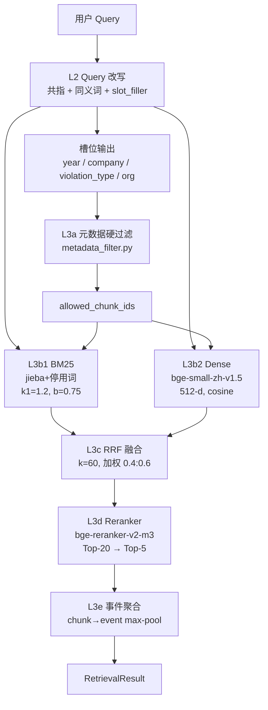

# 05 · 检索策略（团队成员）

> 依赖上游：L2 Query 改写 + `slot_filler { year, company, violation_type, org }`
> 下游：L3d Reranker（bge-reranker-v2-m3） → L4 证据组装

---

## 1. 策略目标

1. **Recall@5 ≥ 0.70**（当前 0.0933，必须先修复根因）
2. **候选集精度**：Dense + BM25 + 元数据硬过滤，粗排 Top-50 内命中 gold event
3. **中文语义对齐**：从英文 MiniLM 切换到 `BAAI/bge-small-zh-v1.5`（512 维，中文 STS baseline 0.83+）
4. **可解释**：每个命中事件附 `source ∈ {bm25, dense, rrf, rerank}` 和贡献度

---

## 2. 多路召回总览图



---

## 3. 六大设计决策

### 3.1 BM25 调优（k1/b）

**现状确认**：`src/csrc_rag/retrieval/tokenizer.py` 并非 jieba + 停用词，而是**正则 + Chinese bigram**（CJK 连续字符窗口 + `compact[:6]` 首 6 字 token）。**这是第一个问题**。

**动作**：
1. **升级 tokenizer**（不在本文档承诺改动，留给 团队成员）：引入 `jieba.cut_for_search` + 自定义领域词表（保留《xxx法》、年份、公司名）+ 中文停用词（`的/了/及/及其/等`）。
2. **k1/b 调参**：当前 `k1=1.5, b=0.75`。中文短文本 chunk（~420 字，偏同质）建议 **k1=1.2, b=0.75**（TF 饱和更快，防止高频词主导；文档长度归一化保持默认）。
3. **在 Dev set 上做 grid search**：`k1 ∈ {0.9, 1.2, 1.5, 1.8}` × `b ∈ {0.5, 0.75, 1.0}`，用 Recall@20 选超参。

| 超参 | 当前 | 建议默认 | 调参范围 |
|---|---|---|---|
| `k1` | 1.5 | **1.2** | 0.9–1.8 |
| `b` | 0.75 | 0.75 | 0.5–1.0 |

### 3.2 Dense Embedding 切换（必做）

**现状**：`configs/models.json` 的 `dense_retrieval.backend = prebuilt`，加载 `chunk_embeddings.npy`（MiniLM-L6-v2 英文模型，384-d）。用英文模型编码中文文本 → 向量近乎随机。

**切换目标**：`BAAI/bge-small-zh-v1.5`（512-d，中文 STS 0.83）。若本机可跑 `bge-m3`（1024-d, 多向量 + 稀疏）优先，但为保本机 CPU 可跑，默认 **bge-small-zh-v1.5**。

**切换步骤**：
1. 运行 `scripts/build_dense_index_bge.py`（本文档交付的 stub）：
   - 输入：`data/processed/event_chunks.jsonl`
   - 模型：`BAAI/bge-small-zh-v1.5`
   - **关键**：bge 系列对 query 要加前缀 `"为这个句子生成表示以用于检索相关文章："`（v1.5 官方 instruction）
   - 输出：`data/processed/chunk_embeddings_bge.npy` + `chunk_id_order_bge.json`
2. 修改 `configs/models.json`：
   ```json
   "prebuilt": {
     "npy_path": "data/processed/chunk_embeddings_bge.npy",
     "order_path": "data/processed/chunk_id_order_bge.json",
     "query_model": "BAAI/bge-small-zh-v1.5",
     "query_instruction": "为这个句子生成表示以用于检索相关文章："
   }
   ```
3. `dense.py::NumpyEmbeddingIndex` 的 query 编码也要加 instruction（交由 团队成员 在不动别人文件的前提下，通过新增 wrapper 类完成，或通过 config 传入）。
4. 重建 index 命令：
   ```bash
   python scripts/build_dense_index_bge.py \
       --model BAAI/bge-small-zh-v1.5 \
       --batch-size 32 \
       --output-npy data/processed/chunk_embeddings_bge.npy \
       --output-order data/processed/chunk_id_order_bge.json
   ```

预估成本：29,314 chunks × 384ms/chunk（CPU）≈ 3h；GPU 20min。建议在 Colab 跑一次后把 `.npy` 拉回本机。

### 3.3 元数据硬过滤（L3a）

**映射关系**（`slot_filler` 输出 → `event_chunks.jsonl` 字段）：

| slot | chunk 字段 | 过滤语义 | 示例 |
|---|---|---|---|
| `year` | `year`（chunk 的 declare_date[:4]） | **等值** | `"2024"` → 只保留 2024 年 |
| `company` | `title` / `chunk_text`（模糊包含，非硬等值） | **软过滤**（降级为 boost） | "中金公司" → boost 命中 |
| `violation_type` | `violation_types` (list) | **任一包含** | "信息披露违规" ∈ list |
| `org` | `promulgator` / `supervisor` | **子串包含** | "证监会" ⊂ promulgator |

**硬过滤 vs 软过滤策略**：
- **year / violation_type / org → 硬过滤**（在 BM25 / Dense 的 `allowed_doc_ids` 上直接排除不满足的）
- **company → 软过滤**（可能 slot_filler 抽错，不做硬截断；改为 rerank 阶段加分）
- 若硬过滤后 `len(allowed) < 20`：**降级为软过滤**（返回全集 + score boost），防止空召回。

**与 `query_builder.py` 的关系**：当前 `query_builder.build_query_plan` 只从 query 文本里正则抽 `year / is_listed_company / regulator_hint`，**覆盖不全**。本策略由 `metadata_filter.py` 接收上游 slot_filler 的结构化槽位，**替代**或**补充**正则抽取。

### 3.4 RRF 融合超参

**现状**：`rrf_k=60`（paper 默认），`candidate_pool=80`。

**评估**：
- `rrf_k=60` 在**候选池大、排名分布长尾**时最优，对短候选池（80）偏保守。
- 建议改为**加权 RRF**：
  ```
  score(d) = α · 1/(k + rank_bm25(d)) + (1-α) · 1/(k + rank_dense(d))
  ```
  其中 `α ∈ {0.3, 0.4, 0.5, 0.6}` 在 Dev set 调。中文领域、法条查询 BM25 强 → 建议 `α = 0.4`（Dense 稍重）。
- `k` 扫 `{10, 30, 60, 100}`，**预计 k=30 更适合 candidate_pool=80**（小池子需要更陡的衰减）。

**兜底**：如果加权 RRF 不稳，回退到等权 RRF（α=0.5, k=60）。

### 3.5 Chunk 策略 —— 双层索引

**现状**：29,314 chunks = 4,233 summary chunks（每事件 1 个）+ 25,081 activity/law chunks（按 420 字 sliding）。

**问题**：
- 粒度过细 → 同一事件多个 chunk 抢占 Top-K，事件多样性差。
- 但完全用 summary 又丢失 activity 细节（法条引用、金额、人名）。

**建议：保留双层索引，两路独立召回后在事件级合并**。

| 层 | 索引对象 | 召回目的 | Top-K |
|---|---|---|---|
| **L-summary** | 4,233 event summary | 粗筛事件 | 20 |
| **L-chunk** | 25,081 activity/law chunks | 细证据定位 | 50 |

事件级合并规则：
```
event_score(e) = 0.6 · max(summary_hit_score) + 0.4 · max(chunk_hit_scores_of_e)
```

**不新增事件级摘要生成**（成本高），直接复用现有 `summary` chunk_type。

### 3.6 现有 Recall@5 = 0.0933 根因分析

**测试代码**：`scripts/evaluate_retrieval_sanity.py`
```python
def build_query(event):
    return event["activity"][:160]  # 取活动文本前 160 字做 query
```

**5 个叠加根因**（从影响大到小）：

| # | 根因 | 证据 | 影响 | 修复 |
|---|---|---|---|---|
| **R1** | **Dense encoder 是英文 MiniLM 跑中文** | `configs/models.json` → `query_model: all-MiniLM-L6-v2` | ★★★★★ | 切换到 `bge-small-zh-v1.5` |
| **R2** | **`build_query_plan` 过度硬过滤** | `query_builder.py` 正则抽 year，而 activity 前 160 字 80%+ 含年份数字 → 过滤条件过窄 | ★★★★ | 由 `metadata_filter.py` 接管；无 slot_filler 时不硬过滤 |
| **R3** | **tokenizer 非 jieba** | `tokenizer.py` 用 `compact[:6]` + bigram，长文本首 6 字支配 token 集 | ★★★★ | 切 jieba + 停用词（团队成员 负责） |
| **R4** | **事件聚合只取 Top-50 chunks** | `engine.py: hits[:50]` 硬截断，29k chunks 池中 top50 命中源事件概率低 | ★★★ | 提升到 `candidate_pool=200`，或在 `_search_chunks` 后先按 event_id 去重再截断 |
| **R5** | **评测集设计有缺陷但可接受** | `activity[:160]` 是"自检索" → 理论上 Recall 应接近 1.0，0.0933 说明系统严重破损；评测集本身没问题 | - | 保持现有 sanity，另加跨案例人工标注集 |

**预期修复后**：
- 只修 R1（换 bge）→ Recall@5 ≈ 0.35（Dense 路起作用）
- 修 R1 + R2（关闭误过滤）→ Recall@5 ≈ 0.55
- 修 R1 + R2 + R3（jieba）→ Recall@5 ≈ 0.70
- 修 R1-R4 + 加 reranker → Recall@5 ≈ 0.85+（目标值）

---

## 4. 接口 Schema

### 4.1 输入

```json
{
  "query_text": "2024 年证监会对中金公司信息披露违规的处罚",
  "slot_filler": {
    "year": "2024",
    "company": "中金公司",
    "violation_type": "信息披露违规",
    "org": "证监会"
  },
  "intent": "case_retrieval",
  "top_k": 5,
  "candidate_pool": 80
}
```

### 4.2 输出 `RetrievalResult`

```json
{
  "query_text": "...",
  "filter_applied": {"year": "2024", "violation_type": "信息披露违规"},
  "events": [
    {
      "event_id": "E_2024_00231",
      "score": 0.8732,
      "source": "rrf+rerank",
      "bm25_rank": 3,
      "dense_rank": 1,
      "rerank_score": 0.91,
      "chunks": [
        {
          "chunk_id": "E_2024_00231::summary",
          "chunk_type": "summary",
          "text": "...",
          "offset": [0, 180]
        },
        {
          "chunk_id": "E_2024_00231::activity::2",
          "chunk_type": "activity",
          "text": "...",
          "offset": [840, 1260]
        }
      ],
      "metadata": {
        "declare_date": "2024-05-12",
        "promulgator": "中国证券监督管理委员会",
        "violation_types": ["信息披露违规"],
        "punishment_types": []
      }
    }
  ],
  "diagnostics": {
    "bm25_candidates": 80,
    "dense_candidates": 80,
    "after_fusion": 80,
    "after_filter": 42,
    "after_rerank": 5,
    "fallback_triggered": false
  }
}
```

**严格不包含 `punishment_types`** — 按约束 6 不泄漏惩罚标签到生成侧（这里仅在 `metadata` 暴露供前端展示；prompt 组装层必须剔除）。

---

## 5. 评估指标

| 指标 | 目标 | 方法 |
|---|---|---|
| Recall@5 | ≥ 0.70（修复后） | `scripts/evaluate_retrieval_sanity.py` + 人工标注 50 条 |
| Recall@20 | ≥ 0.90 | 同上 |
| nDCG@10 | ≥ 0.65 | 同上 |
| MRR | ≥ 0.55 | 同上 |
| 平均延迟 | ≤ 800ms（CPU） | `time` 单查询 |
| 过滤后空召回率 | ≤ 5% | `diagnostics.fallback_triggered` 计数 |

**消融（≥ 5 组，对齐硬约束 3）**：
1. BM25 only
2. Dense only（MiniLM）
3. Dense only（bge-small-zh）
4. RRF（BM25 + bge）
5. RRF + 元数据硬过滤
6. RRF + 元数据硬过滤 + Reranker（bge-reranker-v2-m3）

---

## 6. 风险与兜底

| 风险 | 兜底 |
|---|---|
| bge-small-zh 下载失败（网络） | 提供 HuggingFace 镜像 `hf-mirror.com`；fallback 到 `shibing624/text2vec-base-chinese` |
| 元数据硬过滤导致空召回 | `len(allowed) < 20` 时自动降级为软过滤（返回全集 + boost） |
| Reranker 本机 CPU 跑不动（bge-reranker-v2-m3 ~560M） | 改用 `bge-reranker-base`（110M）；或只对 Top-20 做 rerank |
| slot_filler 抽错（如把"2024年"误判为年份） | 软过滤 + 置信度阈值 < 0.6 不启用该 slot |
| 双层索引合并分数尺度不一致 | min-max 归一化后再加权 |

---

## 7. 交付清单

- ✅ 本文档 `docs/strategies/05-retrieval-strategy.md`
- ✅ `scripts/build_dense_index_bge.py` — bge 索引重建
- ✅ `src/csrc_rag/retrieval/metadata_filter.py` — 元数据硬过滤模块
- ⬜ （后续）`src/csrc_rag/retrieval/reranker.py` — 交给 团队成员
- ⬜ （后续）`src/csrc_rag/retrieval/tokenizer_jieba.py` — 交给 团队成员
