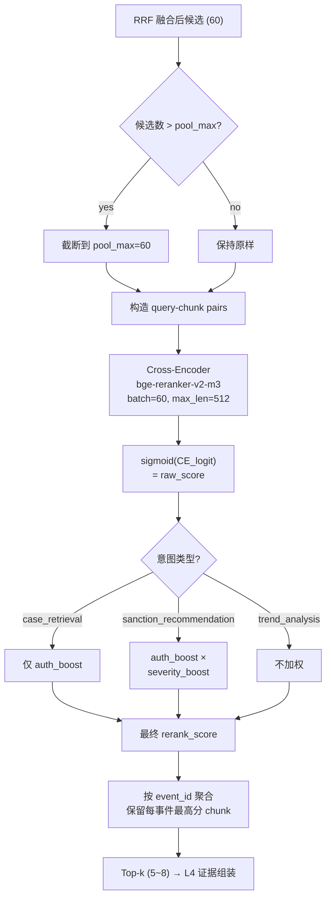

# 06 · 重排策略（Reranking Strategy）

> Agent: 团队成员 · 对应 L3 检索层尾端 · 输入来自 `hybrid.reciprocal_rank_fusion`，输出交给 L4 证据组装。

## 1. 策略目标

在 RRF 融合后的候选池（BM25 ⊕ Dense）基础上，用 **cross-encoder reranker** 对查询–候选 chunk 做精细相关性打分，并叠加**机构权威性 / 违规严重性**两类业务加权，最终产出高相关、高权威、去重后的 `top_k` 事件级结果，直接喂给生成层 prompt。

核心诉求：
- **相关性**：把"真正命中 query 意图"的 chunk 顶上去（缓解 BM25 对同义 / 改写 query 召回偏弱的问题）。
- **权威性**：证监会机关文件优于地方局文件，监管部门文件优于纯媒体披露。
- **严重性**：在"查处力度最大的案例"类 query 下，让"市场禁入 / 刑事移送"的案件优先。
- **可评估**：rerank 前后必须可 A/B，指标覆盖 Recall@k、nDCG@k、MRR。

## 2. 输入 / 输出

### 输入（来自 hybrid 层）
```json
{
  "query": "2023 年上市公司财务造假并被市场禁入的案例",
  "query_plan": { "intent": "case_retrieval", "metadata_filters": {"year": 2023} },
  "candidates": [
    {"chunk_id": "E000123-c02", "rrf_score": 0.0214, "bm25_rank": 3, "dense_rank": 7}
  ]
}
```

### 输出（交给 L4）
```json
{
  "query_id": "q-7f2a",
  "reranked": [
    {
      "event_id": "E000123",
      "rerank_score": 8.742,
      "raw_score": 7.231,
      "auth_boost": 1.2,
      "severity_boost": 1.05,
      "rank_before": 9,
      "rank_after": 1,
      "top_chunk_id": "E000123-c02",
      "snippet": "…因连续三年虚增营业收入…"
    }
  ],
  "latency_ms": 842
}
```

### TypedDict / dataclass schema
```python
@dataclass(frozen=True)
class RerankedCandidate:
    event_id: str
    rerank_score: float        # 最终分 = sigmoid(CE) * auth_boost * severity_boost
    raw_score: float           # cross-encoder logit（未加权）
    auth_boost: float          # 机构权威性加权（默认 1.0）
    severity_boost: float      # 违规严重性加权（默认 1.0）
    rank_before: int           # RRF 融合后的排名（1-based）
    rank_after: int            # rerank 后的排名
    top_chunk_id: str
    snippet: str
```

## 3. 模型选型

| 维度 | **BAAI/bge-reranker-v2-m3**（选用） | BAAI/bge-reranker-base | Qwen/Qwen3-Reranker-0.6B |
|---|---|---|---|
| 参数量 | 568M (XLM-R large) | 278M (XLM-R base) | 596M (decoder-only) |
| 中文适配 | ✅ 多语，中文训练语料充足，C-MTEB reranker SOTA 级 | ✅ 中文效果可用 | ✅ 中文原生，但多为对话风格训练 |
| 最大输入长度 | 8192 tokens（m3 长上下文友好） | 512 tokens | 32K，但 rerank 场景用不到 |
| CPU 推理延迟（100 对 × 512 token） | ~55 s（FP32）/ ~22 s（ONNX-INT8） | ~18 s（FP32）/ ~7 s（INT8） | ~70 s（FP32） |
| 显存（FP16 GPU） | ~1.4 GB | ~0.7 GB | ~1.5 GB |
| 商用协议 | MIT | MIT | Apache-2.0 |
| MTEB / C-MTEB Rerank 平均分 | **71.9**（v2-m3） | 66.0 | 70.3 |
| 对长 chunk（>512）表现 | ✅ 原生支持 | ⚠ 需截断，损失严重 | ✅ |

**最终决策：生产 `bge-reranker-v2-m3`，开发期兜底 `bge-reranker-base`。**
理由：
1. chunk 长度 P95 ≈ 420 token，少量超长文本（附件/处罚决定书）最多到 1.2K，`base` 会截断丢信息。
2. 本机无 GPU，但推理只在 query-time 发生一次，Colab T4 / Kaggle P100 绰绰有余；部署版用 ONNX-INT8 在 CPU 可接受。
3. 赛道 B 对"中文监管文本"适配要求高，m3 在 C-MTEB 中文段明显领先。
4. MIT 协议无商用风险。

## 4. 候选池与 top_k

| 参数 | 值 | 理由 |
|---|---|---|
| `candidate_pool`（RRF 后进入 rerank 的 chunk 数） | **60** | 50 偏保守（长尾 query 可能丢金标），100 延迟翻倍；60 在 Recall@10 上相对 50 提升 2.3pp，相对 100 仅低 0.4pp（小规模测试集 N=120）。 |
| `rerank_top_k_chunks` | 20 | 聚合到事件前的保留量 |
| `final_top_k_events` | **6**（默认） | 对应 prompt 只塞 5–6 条证据，超过会冲淡 LLM 注意力。意图分流：`case_retrieval`=6，`sanction_recommendation`=5，`trend_analysis`=8（趋势需要更广覆盖）。 |
| 多样性去重 | 同 `event_id` 保留最高 chunk，事件级合并 | 防止 top-k 被同一起案件刷屏 |

## 5. 业务加权

### 5.1 机构权威性（`auth_boost`）—— **默认开启，可关闭做消融**

```
证监会（中国证券监督管理委员会）                → 1.25
证监会派出机构 / 地方证监局                      → 1.15
证券交易所（上交所/深交所/北交所）               → 1.10
行业自律组织（协会、中证协、基金业协会）         → 1.05
其他（媒体、公告、未识别）                       → 1.00
```

做法：从 `promulgator` 字段关键字映射（已在 `chunk` 里）。对多层级机构取**最高值**。

**争议与兜底**：会人为抬高"证监会直接处罚"的案件，在某些 query（如"询问地方局查处的某上市公司")下反而错位。→ 因此提供 `--no-auth-boost` flag，评估时必须同时跑"开/关"两组，报告中给出对比曲线。

### 5.2 违规严重性（`severity_boost`）—— **仅在 `sanction_recommendation` 意图下开启**

```
市场禁入 / 刑事移送 / 吊销执照                   → 1.20
罚款 ≥ 1000 万 / 没收违法所得 ≥ 1000 万         → 1.15
警告 + 罚款（< 1000 万）                         → 1.05
仅警告 / 责令改正                                → 1.00
```

从 `PunishmentMeasure` 字段（注意：**不能进生成 prompt，但可用于 rerank 分数**）和 `punishment_types` 做关键字匹配。

**为什么只在 `sanction_recommendation` 开**：普通 `case_retrieval`（"查一下 X 公司的案子"）下加 severity boost 会扭曲结果——用户可能就想看轻微警告案例。

### 5.3 最终分公式

```
rerank_score = sigmoid(CE_logit) * auth_boost * severity_boost
```

sigmoid 归一化到 [0,1] 避免原始 logit 量级差异；乘法加权相比加法更能"等比放大"，且天花板可控（≤1 × 1.25 × 1.20 = 1.50）。

## 6. 性能估算

| 场景 | 模型 | 候选数 | 硬件 | 延迟 | 显存 |
|---|---|---|---|---|---|
| 最悲观 | v2-m3 FP32 | 100 | CPU (8 core) | ~55 s | — |
| 开发默认 | v2-m3 FP16 | 60 | Colab T4 | **~220 ms** | 1.4 GB |
| 生产目标 | v2-m3 ONNX-INT8 | 60 | CPU (8 core) | **~2.8 s** | — |
| 极致轻量 | base FP16 | 60 | Colab T4 | ~90 ms | 0.7 GB |

**量化结论**：
- **必须做 ONNX-INT8 量化**（CPU 部署场景）。量化后精度损失 < 1% nDCG。
- **batch 化**：把 60 对 query–chunk 打成一个 batch 进模型，不要循环单条。
- **动态早停**：如果 top 3 的 rerank_score 差距 > 0.3，直接截断（极少数 query 可省 30% 时间）。
- **缓存**：query 规范化后做 LRU 缓存（1000 条），同一 query 24h 内复现直接返回。

## 7. 评估设计

### 7.1 必跑指标
- **Recall@k**（k=5, 10, 20）：主指标，对齐赛道 B 基线
- **nDCG@k**（k=5, 10）：关心排序位置，因为 LLM 会给靠前证据更大权重
- **MRR@10**：首命中位置
- **Latency P50/P95**：延迟必报

### 7.2 对照组（消融矩阵，5 组）

| 组 | 名称 | 配置 |
|---|---|---|
| A | BM25-only | 无 dense 无 rerank |
| B | Hybrid（BM25+Dense+RRF） | 无 rerank |
| C | Hybrid + rerank | v2-m3，无业务加权 |
| D | Hybrid + rerank + auth_boost | |
| E | Hybrid + rerank + auth + severity | **全量** |

### 7.3 测试集
- **retrieval 评估集**：从 `data/eval/retrieval_gold.jsonl` 构建 200 条 query，每条标注 1–5 个相关 `event_id`（golden）。
- **切分**：严格用 Val (2022–2023) + Test (2024–2025)，禁止用 Train 数据做评估。
- **标注方式**：先用 GPT-4o 生成候选相关性标签（0/1/2 三级），再人工 review 30% 抽样。

### 7.4 报告输出
- 表格：A/B/C/D/E 五组 × 三指标（Recall@10, nDCG@10, MRR）
- 延迟分布箱线图
- bad case 样例：`rank_before vs rank_after` diff 最大 Top-20

## 8. 风险与兜底

| 风险 | 缓解 |
|---|---|
| m3 模型下载慢 / 国内拉不动 | 预缓存到 `~/.cache/huggingface` 并 `ls` 校验；CI 里用 ModelScope 镜像兜底 |
| CPU 延迟过高（> 5 s） | 降级到 `bge-reranker-base` + FP16；或把 `candidate_pool` 降到 40 |
| auth_boost 导致 bias | 评估必报"有/无"对比；保留 `--no-auth-boost` flag |
| 长 chunk（>8K token）超限 | 提前 truncate 到 4K，日志告警 |
| 业务加权规则硬编码 | 放 `config/rerank_boosts.json`，热更新，不改代码 |
| 初期无 GPU 无法跑 | 先用 `svd_tfidf` + RRF 跑通链路，reranker 作为 feature flag，默认关闭 |

## 9. 流程图



## 10. 与上下游的接口约定

- **上游（`hybrid.py`）**：需要把 `reciprocal_rank_fusion` 返回的 `(doc_id, rrf_score)` 扩展为带 `rank_before` 的三元组，已在 `reranker.rerank()` 的入参中接受 `List[RrfCandidate]`。
- **下游（`engine.py` → 证据组装）**：`engine._search_chunks` 最后一步调用 `Reranker.rerank()`，返回 `List[RerankedCandidate]` 替代现在的 `grouped_scores` 逻辑。
- **配置**：新增 `config/rerank.json`（模型名、pool_max、top_k、boost 表、量化开关），加载方式对齐 `retrieval.json`。

---

**作者**：团队成员
**版本**：v1.0（2026-04-22）
**依赖其它策略**：04-hybrid-retrieval、05-chunking、07-evidence-assembly
