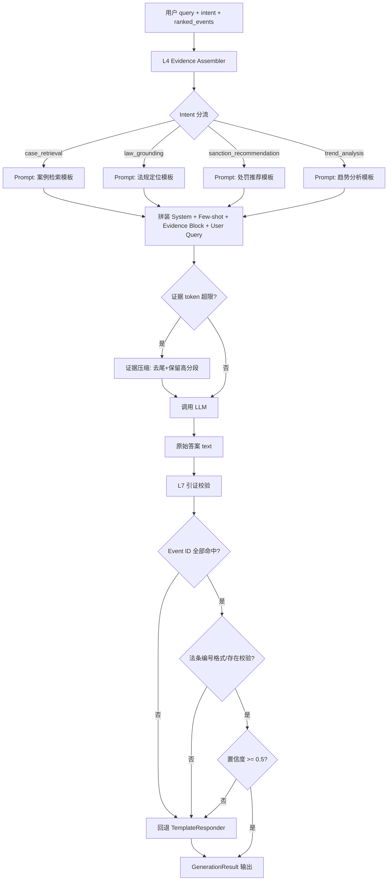

# 07 · 模型回复策略（团队成员）

> 负责：L5 生成层 + L7 引证校验。作用于 **推理时**（不含训练流程）。
> 上游：L4 证据组装（Retriever）→ ranked_events。
> 下游：前端渲染 + L7 后处理。

---

## 1. 策略目标

1. **强证据约束**：答案中每一条事实必须挂到具体证据（EventID / 法条编号），杜绝"凭空编"。
2. **四意图模板化**：`case_retrieval / law_grounding / sanction_recommendation / trend_analysis` 各自的答题结构固定，便于 L7 校验。
3. **可兜底**：当 LLM 生成失败、超时、或引证校验失败率 > 阈值，自动回退到已有 `TemplateResponder`。
4. **可评估**：与论文的"有/无 RAG + 有/无强证据约束"三组对照对齐，输出字段结构化。

---

## 2. 输入 / 输出

### 输入
```python
GenerationInput = {
    "query": str,                          # 原始或改写后的用户 query
    "intent": IntentSpec,                   # L1 识别结果
    "ranked_events": list[EventHit],        # L4 组装好的证据（带 score）
    "history": list[{role, content}] | None # 多轮上下文
}
```

### 输出接口 schema
```python
class GenerationResult:
    text: str                      # 最终展示文本（已通过 L7 校验）
    cited_event_ids: list[str]     # 答案里出现的 [EventID=xxx] 全部列出（去重）
    cited_laws: list[str]          # 答案里出现的 [法条：《xx》第xx条]（去重）
    backend: str                   # "lora_qwen" | "local_hf" | "template" | "template_fallback"
    confidence: float              # [0,1] 综合置信度（见 §6）
    validation: {
        passed: bool,
        missing_event_ids: list[str],   # 答案里引用但不在证据集里的 EventID
        invalid_laws: list[str],         # 法条编号格式错误或不存在
        unsupported_claims: list[str]    # 未挂引证的敏感断言（数字/金额/结论）
    }
```

---

## 3. 生成流水线



---

## 4. Prompt 工程

### 4.1 Zero-shot vs Few-shot 决策

| 意图 | 选型 | 理由 |
|-----|------|------|
| case_retrieval | **zero-shot** | 结构简单（列出 Top-N），示例反而占 token |
| law_grounding | **four-shot** | 法条引用格式强约束，需示例示范 `[法条：《xx》第xx条]` 格式 |
| sanction_recommendation | **four-shot** | 推荐理由格式 + 统计口径必须有范例 |
| trend_analysis | **zero-shot** | 输出结构由 schema 控制，证据里已有统计摘要 |

> Few-shot 示例来自 `data/processed/qa_examples.jsonl`（由 团队成员 构造），每条 ≤ 80 字 + 1 个证据。

### 4.2 System Prompt（全局通用）

```
你是证监会违规处罚案例的分析助手。严格遵循以下铁律：
1. 【仅凭证据】只能使用 <EVIDENCE> 块中的事实，禁止编造案例、法条、金额、日期。
2. 【必须引证】
   - 每提及一个具体案例，必须以 [EventID=xxxx] 格式标注（xxxx 为证据中的 event_id 原值）。
   - 每引用一条法规条款，必须以 [法条：《xx法》第xx条] 格式标注。
3. 【证据不足处理】当 <EVIDENCE> 不足以回答用户问题时，直接输出："证据不足，建议缩小查询范围"，不要强行拼凑。
4. 【格式】使用简体中文；不输出 markdown 表情符号；每段不超过 4 行；不复述用户原话。
5. 【边界】不给出正式法律意见；处罚推荐仅供参考，必须附免责声明。
```

### 4.3 四种意图的完整 Prompt 模板

#### (A) case_retrieval（zero-shot）

```
<SYSTEM>
... 上述 system prompt ...

<TASK>
任务：案例检索。用户在问"类似的违规案例"，请从证据中筛选最相关的 3–5 条案例，按相似度降序列出。

<EVIDENCE>
[EventID=E001] 标题：xxx | 时间：2023-05 | 机构：xxx证监局 | 处罚：罚款/警告 | 摘要：...
[EventID=E002] ...
...

<USER_QUERY>
{query}

<OUTPUT_FORMAT>
结论：一句话总结。
相关案例：
1. [EventID=E001] 标题 · 时间 · 机构 · 一句话事由
2. [EventID=E002] ...
补充说明（可选，≤ 2 句）。
```

#### (B) law_grounding（four-shot）

```
<SYSTEM>
... 上述 system prompt ...

<TASK>
任务：法规定位。用户想知道"什么行为触犯了什么法条"，请从证据中抽取被引用的法条，并对应到案例。

<EXAMPLES>
示例1：
Q: 内幕交易一般违反哪条法规？
Evidence: [EventID=E010] 法规：《证券法》第五十三条
A: 内幕交易行为主要违反 [法条：《证券法》第五十三条]，参见 [EventID=E010]。

示例2：
Q: 信息披露违规的处罚依据？
Evidence: [EventID=E020] 法规：《证券法》第一百九十七条
A: 信息披露违规的常见依据是 [法条：《证券法》第一百九十七条]，代表案例 [EventID=E020]。

示例3：
Q: 操纵市场引用什么法条？
Evidence: [EventID=E033] 法规：《证券法》第五十五条
A: 操纵证券市场行为违反 [法条：《证券法》第五十五条]，参见 [EventID=E033]。

示例4：
Q: 证据不足示例
Evidence: （无匹配法条）
A: 证据不足，建议缩小查询范围。

<EVIDENCE>
...
<USER_QUERY>
{query}

<OUTPUT_FORMAT>
1. 主要法条：[法条：《xx》第xx条] — 适用场景
2. 代表案例：[EventID=...]（至多 3 条）
3. 风险提示（1 句）
```

#### (C) sanction_recommendation（four-shot）

```
<SYSTEM>
... 上述 system prompt ...

<TASK>
任务：处罚方式推荐。基于历史相似案例统计，给出最可能的处罚方式及代表案例，**不得作为正式执法依据**。

<EXAMPLES>
示例1：
Q: 上市公司虚假陈述一般怎么罚？
Evidence: 5 个相似案例，处罚方式分布：警告+罚款 3、没收违法所得 1、市场禁入 1
A: 最可能的处罚方式：
1) 警告+罚款（占 60%），代表案例 [EventID=E101]、[EventID=E102]。
2) 没收违法所得（占 20%），代表 [EventID=E103]。
法规依据：[法条：《证券法》第一百九十七条]。
⚠ 以上仅基于历史案例统计，不构成正式执法意见。

示例2、3、4：...（省略，实现时填入）

<EVIDENCE>
...
<USER_QUERY>
{query}

<OUTPUT_FORMAT>
推荐处罚方式（Top 3，带占比）；法规依据；代表案例；免责声明。
```

#### (D) trend_analysis（zero-shot）

```
<SYSTEM>
...

<TASK>
任务：趋势分析。给出年度分布 / 机构分布 / 处罚类型分布，基于证据中已统计好的数字，禁止外推。

<EVIDENCE_STATS>
年度：2021:8, 2022:15, 2023:22, 2024:18
处罚 Top：罚款 40、警告 25、市场禁入 5
...

<USER_QUERY>
{query}

<OUTPUT_FORMAT>
总览一句话；年度趋势；主要处罚类型；峰值年份；代表案例 [EventID=...] × 2；统计口径声明。
```

---

## 5. 证据组装（Context Block）

### 5.1 拼装格式
每条证据按行：
```
[EventID={id}] 标题：{title} | 时间：{date} | 机构：{org} | 处罚类型：{pt} | 法规：{laws} | 摘要：{snippet[:180]}
```

### 5.2 Top-k 选取
- 默认 k = 6（case_retrieval 取 6，其余取 4）
- 输入上限：`max_ctx_tokens = 1800`（Qwen2.5-1.5B 上下文 32k，但留出给生成和 system）
- 每条证据硬上限：`per_ev_max = 260 tokens`

### 5.3 超限截断策略

**规则：保留高分段 + 去尾**
```
while token_count(evidence_block) > max_ctx_tokens:
    if len(events) > 3:
        drop events[-1]       # 先丢分数最低的
    else:
        shrink snippet of events[-1] by -60 tokens
```

- **不掐头**：Top-1 永远保留完整。
- **去尾**：优先丢最低分证据。
- **段内压缩**：仅保留 snippet 首 180 字 + 法规标题，不保留全文。
- 若 `case_retrieval`，允许只留标题 + 日期 + 机构（摘要压为 60 字）。

---

## 6. 置信度计算

```
confidence = 0.4 * avg_top3_retrieval_score
           + 0.3 * citation_coverage         # 答案里引证数 / 答案里断言数
           + 0.2 * evidence_count_norm       # min(k, 5) / 5
           + 0.1 * (1 - unsupported_ratio)   # 数字/金额未挂引证的比例
```
- `confidence < 0.5` → 触发 TemplateResponder 兜底
- `confidence < 0.3` 且 intent ∈ {law_grounding, sanction_recommendation} → 直接输出"证据不足"文案

---

## 7. L7 引证校验规则清单

| 编号 | 规则 | 严重性 | 行为 |
|------|------|--------|------|
| L7-1 | 答案中的 `[EventID=xxx]` 必须全部在 `ranked_events` 的 id 集合里 | CRITICAL | 失败→回退 Template |
| L7-2 | `[EventID=...]` 出现次数 ≥ 1（除 trend_analysis 可为 0） | HIGH | 失败→回退 |
| L7-3 | `[法条：《xx》第xx条]` 格式正则：`\[法条：《[^》]{1,40}》第[\d一二三四五六七八九十百]+条(之[\d一二三四五六七八九十]+)?\]` | HIGH | 格式不符→移除该引证片段并标记 |
| L7-4 | 法条名在"白名单"（证券法/公司法/基金法/期货和衍生品法/刑法 等）内 | MEDIUM | 不在→保留但标记 warning |
| L7-5 | 数字/金额/百分比出现时，同段必须有 `[EventID=` 或 `[法条：` 之一 | MEDIUM | 否则加入 `unsupported_claims` |
| L7-6 | 答案长度 ≤ 800 字 | LOW | 截断 |
| L7-7 | 禁用词：`根据法律，必须判处`、`法院已判决` 等越权表述 | HIGH | 触发→替换为"建议参考" |
| L7-8 | sanction_recommendation 必含免责声明关键词（`仅供参考` 或 `不构成执法`） | HIGH | 缺失→自动追加 |

---

## 8. 多轮对话 history 处理

- **进 prompt**：仅 case_retrieval / trend_analysis 进 history。
- **轮数**：最近 **2 轮**（user+assistant = 4 条消息），超过丢弃。
- **压缩**：每条 ≤ 80 字，超过用 summarizer 压缩（本阶段先直接截断）。
- **law_grounding / sanction_recommendation 不进 history**：避免上轮噪声污染法条引用。

---

## 9. 兜底链（Fallback Chain）

```
primary (LoRA Qwen2.5-1.5B)
   ↓ [失败/超时/L7 L7-1,L7-2 不过/confidence < 0.5]
fallback-1 (LocalHFResponder 基础模型)
   ↓ [失败]
fallback-2 (TemplateResponder 规则模板)   # 已存在，只需调用
   ↓
必出结果（永不 crash）
```

- 超时阈值：`primary_timeout = 30s`（CPU 可能较慢）
- LoRA 调用失败自动降级到 base model
- 兜底响应在 `GenerationResult.backend` 字段中体现（`"template_fallback"`）

---

## 10. 评估指标

| 指标 | 目标 | 评估方式 |
|------|------|----------|
| 引证命中率 (citation@EventID) | ≥ 95% | L7-1 通过率 |
| 法条格式合规率 | ≥ 98% | L7-3 通过率 |
| 兜底触发率 | ≤ 15% | 生产流量统计 |
| 用户可读性 ROUGE-L vs 人工答案 | ≥ 0.45 | 测试集 |
| 幻觉率（人工抽检 100 条） | ≤ 5% | 与"无 RAG"组对比 |

---

## 11. 与上下游接口

**上游 L4**：`list[EventHit]`（含 `event_id, title, declare_date, promulgator, punishment_types, laws, snippets, score`）

**下游前端**：`GenerationResult` JSON（见 §2）

**同步点**：意图分流在 `orchestration/intents.py`，不在此模块重复。

---

## 12. 风险与兜底

| 风险 | 缓解 |
|------|------|
| Qwen2.5-1.5B 在 CPU 上 >30s 超时 | 自动降级到 TemplateResponder；Colab 生成离线缓存 |
| LoRA 权重加载失败 | base model 不带 LoRA 运行，backend 字段标记 |
| 幻觉法条（生成不存在的条款号） | L7-3 正则 + L7-4 白名单双校验 |
| 证据不足但模型强答 | system prompt §3 规则 + confidence < 0.3 强制文案 |
| few-shot 示例偏置导致过拟合 | 每 2 周轮换示例池，A/B 观察 |
