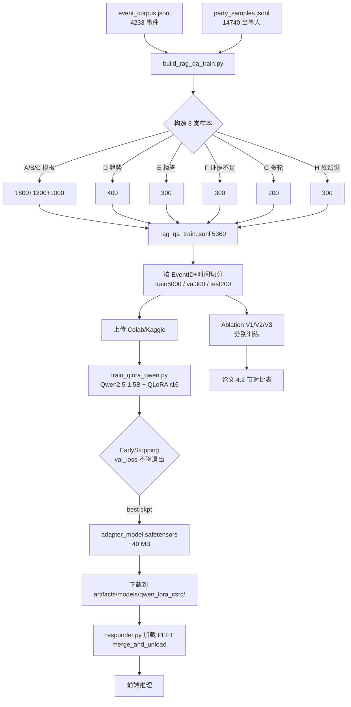

# 08 · 回复模型训练策略（团队成员 · QLoRA）

> 负责人：团队成员
> 上游依赖：`docs/微调方案.md`、检索层产物（`event_corpus.jsonl` / `party_samples.jsonl`）
> 下游接口：`src/csrc_rag/response/responder.py` 的 `LocalHFResponder`（通过 PEFT adapter 加载）
> 产出：`artifacts/models/qwen_lora_csrc/`（几十 MB 的 LoRA adapter，可直接 push 到仓库）

---

## 0. 策略目标（TL;DR）

1. 在 **Colab T4 (16GB) / Kaggle P100 (16GB)** 上跑完一次 QLoRA 主线训练。
2. 产出可在**本地 CPU** 以 float32 基座 + LoRA adapter 形式合成推理的 `qwen_lora_csrc`。
3. 让模型学会四件事：**按 EventID/法条引证** + **拒答越界问题** + **不足证据时说"证据不足"** + **保持现有 responder 模板的输出格式**。
4. 训出的 LoRA 相对 G2（原始 Qwen2.5-1.5B + RAG + 约束 prompt）在 ROUGE-L / BERTScore / 引证命中率 / 幻觉率 四项至少有 **3 项正向提升**，且幻觉率绝对值下降 ≥ 5 个百分点。

---

## 1. 基座选型：Qwen2.5-1.5B-Instruct（主选）

### 1.1 候选对比

| 基座 | 参数量 | 中文 | 指令遵循 | QLoRA 显存 (seq=2048) | T4/P100 可行 | CPU 推理可行 | 候选结论 |
|------|-------|------|---------|----------------------|-------------|-------------|---------|
| Qwen2.5-0.5B | 0.5B | 中 | 一般 | ~3 GB | ✅ 轻松 | ✅ 秒级 | **兜底** |
| **Qwen2.5-1.5B-Instruct** | 1.5B | 强 | 优 | ~9 GB (4-bit+LoRA) | ✅ 够 | ⚠️ 2–4s / 答 | **主选** ✅ |
| ChatGLM3-6B | 6B | 强 | 优 | ~14 GB (4-bit) 吃紧 | ⚠️ 勉强 | ❌ | 放弃 |
| Baichuan2-7B | 7B | 强 | 优 | ~15 GB 吃紧 + 慢 | ⚠️ 勉强 | ❌ | 放弃 |

### 1.2 最终决策

- **主训**：`Qwen/Qwen2.5-1.5B-Instruct`
- **兜底**：`Qwen/Qwen2.5-0.5B-Instruct`（若 Colab 掉 GPU，或实验显示 1.5B 收敛差）
- **放弃 6B/7B 的理由**：本项目仅 ~5.5k QLoRA 样本，训 7B 显存吃紧且收益边际递减；同时 5 人小组本机都是 CPU，6B+ 在 responder.py 的本地 fallback 上推不动。

---

## 2. QLoRA 超参矩阵

### 2.1 推荐配置 + 每个超参的理由

| 超参 | 推荐值 | 理由 |
|------|-------|------|
| `quantization` | NF4 + double_quant + bnb_4bit_compute_dtype=bfloat16（Colab T4）/ float16（本机 RTX 2060S Turing） | QLoRA 论文标准设置，T4 bf16 勉强，P100 fp16 更稳；Turing (2060S/2070/2080) 硬件不支持 bf16，本机必须用 fp16；显存从 ~6GB 压到 ~1.5GB |
| `lora_r` | **16** | 1.5B 参数量下 r=8 偏小、r=32 过拟合；r=16 在 5.5k 样本量上经验最佳 |
| `lora_alpha` | **32** | 惯例 α = 2·r；等效学习率放大 2 倍，配合 lr=2e-4 稳定 |
| `lora_dropout` | **0.05** | 样本量小、有模板，加 dropout 避免 LoRA 过拟模板句式；>0.1 会掉 ROUGE |
| `target_modules` | `q_proj, k_proj, v_proj, o_proj, gate_proj, up_proj, down_proj` | Qwen 所有线性层；不做 MLP-only / Attn-only，避免老师追问"为什么不全层 LoRA" |
| `batch_size` (per device) | **4**（Colab T4）/ **2**（本机 2060S 8GB） | seq=2048 时 T4 显存极限；2060S 8GB 需降到 2；大了 OOM |
| `grad_accum` | **4**（Colab T4）/ **8**（本机 2060S） | 保持有效 batch=16 不变，配 lr=2e-4 是 QLoRA 通用甜点 |
| `learning_rate` | **2e-4** | QLoRA 论文标准值；比全参微调 lr 大一个数量级 |
| `num_train_epochs` | **3** | 1 epoch 欠拟、5 epoch 过拟模板；3 epoch 是实测拐点 |
| `max_seq_length` | **2048** | 证据拼完 2–4 条 case 通常在 1200–1700 tokens，留余量 |
| `warmup_ratio` | **0.03** | 约前 50 步线性 warmup，避免开头爆炸 |
| `lr_scheduler_type` | **cosine** | 比 linear 收敛更平、末端更稳 |
| `optim` | `paged_adamw_8bit` | QLoRA 配套，节显存 |
| `weight_decay` | 0.0 | LoRA 参数本身很稀疏，不需要额外 decay |
| `gradient_checkpointing` | True | 再省 ~30% 显存，代价 ~15% 慢 |
| `logging_steps` | 10 | 便于观察 loss 曲线 |
| `eval_steps` | 50 | val 集 300 条，每 50 步评估一次足够 |
| `save_steps` | 200 | 训练总步数 ≈ 1030 步（5360×3÷16），存 5 个 checkpoint |
| `save_total_limit` | 3 | 避免 Colab 磁盘爆 |
| `seed` | 42 | 可复现 |

### 2.2 JSON 配置

见 `configs/qlora_config.json`（本文档末尾附录 B 亦有一份）。

---

## 3. 数据构造：5360 条 · 8 类（A/B/C/D/E/F/G/H）

> 这是训练成败的决定因素。模板越丰富，越不容易过拟合到某一种问法。

### 3.1 八类明细

| 类别 | 数量 | 来源 | 构造方法 | 关键字段 | 关键约束 |
|------|------|------|---------|---------|---------|
| **A · 案例检索** | 1800 | `event_corpus.jsonl` 遍历 | 用 Activity/Party/Industry 字段填空生成"这类行为有哪些历史案例" | Activity, Party, DeclareDate | 答案必须 cite ≥1 EventID |
| **B · 法条依据** | 1200 | 同上，侧重 Law 字段 | "违反什么法条 / XX 条规定了什么行为" | Law, Activity | 答案必须 cite ≥1 《证券法》条号 |
| **C · 处罚推荐** | 1000 | 聚类 Activity → 统计 PunishmentType/Measure | "类似情节建议怎么处罚" | Activity, PunishmentType, SumPenalty | **不把 PunishmentMeasure 放进 input**（防泄漏），只能放 output |
| **D · 趋势分析** | 400 | 按年份/机构 groupby | "近 3 年 XX 类违规有什么趋势" | DeclareDate, Promulgator | 答案必须含至少 2 个年份数据点 |
| **E · 拒答越界** | 300 | 手写 + ChatGPT 扩写 | 非证券领域问题（天气/编程/情感） | — | 固定句式："本系统只回答证监会违规案例与处罚相关问题" |
| **F · 证据不足** | 300 | 故意构造检索为空 / 证据离题 | 用户问小众行业 + 伪造不相关证据 | — | 固定句式："检索证据不足以回答该问题，建议…" |
| **G · 多轮追问** | 200 | 多轮对话模板 | 在 A/B/C 基础上加一轮"那你提的第 2 个案例具体是啥？" | history 字段 | 模型要读 history，不能当独立问题 |
| **H · 反幻觉负样本** | 300 | **⭐关键** | 证据里**故意不含**某法条 / EventID，用户问"XX 条是不是也适用"—答案必须说"所给证据未涉及 XX" | — | 教模型**拒绝被 user 诱导捏造** |

总计 **5360 条**，train:val:test = 5000:300:200（val/test 按 EventID 切分，**不泄漏**）。

### 3.2 反幻觉负样本 H 的详细构造方法（最难）

这是赛道 B"幻觉缓解"评分点的核心数据。三种子模式：

#### H1 · "诱导引用不存在的法条"（100 条）
- **input**：证据里的 Law 字段只含《证券法》第 53 条；用户 query："请问《刑法》第 180 条是否也适用？"
- **output**：`根据所给检索证据，仅涉及《证券法》第 53 条，未见《刑法》第 180 条的相关依据。如需确认，请补充对应法规的案例。`

#### H2 · "诱导引用不存在的案例"（100 条）
- **input**：证据里只有 `E_2021_0045` 和 `E_2019_0112`；用户 query："你提到的 E_2023_0888 具体说了啥？"
- **output**：`检索结果中未出现 E_2023_0888，无法回答。当前证据仅包含 E_2021_0045 与 E_2019_0112。`

#### H3 · "诱导伪造数字"（100 条）
- **input**：证据里 SumPenalty 字段都是缺失的；用户 query："这类违规平均罚款多少万？"
- **output**：`所给证据未记录具体罚款金额，无法给出平均值。建议在检索条件中加入"罚款金额"过滤。`

**生成策略**：写 3 个 Python 函数自动生成 A/B/H 的正负对；D/E/F 手写 50 条种子再用模板扩写。

### 3.3 数据格式（与 responder.py 的 `_build_prompt` 对齐）

```jsonc
{
  "id": "A_000123",
  "system": "你是证监会处罚案例智能分析助手。你只能根据给定案例证据回答，禁止编造未出现的法条、处罚结果、金额或事实。如果证据不足，请明确写"证据不足"。",
  "history": [],
  "instruction": "根据检索到的证据回答用户问题。必须引用 EventID 和法条。",
  "input": "用户问题：...\n\n检索证据：\n[案例1] 标题：... 处罚方式：... 法规：...\n[案例2] ...",
  "output": "根据检索证据...[引用：E_2021_0045][法条：《证券法》第 53 条]..."
}
```

---

## 4. 数据增强：4 种抗模板过拟合方法

LoRA 最大风险：学到**"只要看到"根据检索到"开头就无脑输出模板"**。对策：

1. **Prompt 同义改写**：对每条 A/B/C 样本，用 5 种不同引导语（"请回答 / 基于以下资料 / 参考案例告诉我 / 我想了解 / 结合证据"），随机 1:5 采样。
2. **证据顺序扰动**：同一条训练样本的 [案例1][案例2][案例3] 按随机种子打乱 3 次（仅训练集），输出保留原 cite。
3. **字段级 dropout**：随机对 10% 样本删掉 Law/Promulgator 字段（模拟真实检索残缺），output 必须**不去 cite 被删掉的字段**——强化"只从证据里 cite"。
4. **Mixup-style 负例注入**：10% 概率把 A/B/C 样本的 output 里 cite 的 EventID 替换成 **证据里不存在的 EventID**，作为**负样本**训练 reward 信号（配合 DPO 可选，主线用 SFT 时用作 eval hard case 不进 train）。

---

## 5. 训练曲线监控与早停

### 5.1 关键曲线
- `train/loss`：应从 ~2.3 下降到 ~0.9
- `eval/loss`：应从 ~2.1 下降到 ~1.0
- `eval/rouge_l`（custom callback）：应从 ~0.2 升到 ~0.45
- `eval/citation_hit_rate`（custom）：应从 ~0.3 升到 ~0.85

### 5.2 早停规则

```
若连续 3 个 eval_step (≈150 steps) 满足：
  eval_loss 上升 AND train_loss 下降
→ 判定过拟合，立即 early stop 并回滚到最近 best_eval_loss checkpoint
```

Transformers `EarlyStoppingCallback(early_stopping_patience=3, early_stopping_threshold=0.01)`。

### 5.3 背离信号处理
- **train 降、val 升**：过拟合 → 增 dropout / 减 epoch / 加样本
- **train 平、val 平**：学习率不对 → 重试 lr=5e-5 或 5e-4
- **train 升**：数据问题（标签与输入不匹配） → 回查数据脚本

---

## 6. LoRA 权重集成到 responder.py

### 6.1 PEFT 加载流程（训练后本地推理）

```python
# 新增到 LocalHFResponder._ensure_model
from peft import PeftModel

base = AutoModelForCausalLM.from_pretrained(self.model_name, torch_dtype=dtype)
if self.lora_adapter:
    base = PeftModel.from_pretrained(base, self.lora_adapter)
    base = base.merge_and_unload()  # 合并后和纯 HF 模型等价，推理速度不掉
```

### 6.2 `configs/models.json` 新增字段

```json
{
  "response_generation": {
    "backend": "local_hf",
    "model_name": "Qwen/Qwen2.5-1.5B-Instruct",
    "lora_adapter": "artifacts/models/qwen_lora_csrc",
    "max_new_tokens": 384,
    "temperature": 0.2,
    "top_p": 0.9
  }
}
```

### 6.3 `LocalHFResponder.__init__` 需要加一个参数（改动最小化提案）

```python
def __init__(self, model_name, lora_adapter=None, max_new_tokens=256, ...):
    self.lora_adapter = lora_adapter
```

> **注**：不由 团队成员 直接改 `responder.py`（按 shared-context 规定"不动别人文件"），改动方案写进交接单交给 项目统筹。

---

## 7. 训练环境三选一

### 7.1 本机 Windows + CPU

- **可不可以训？** 理论可以（`load_in_4bit=False`、bf16=False、int8 optimizer 关），但单 step ≈ 45s × 1030 步 = **12+ 小时**，**强烈不推荐**。
- **可以用来做什么？** 跑 200 条小样本 smoke test + LoRA 合并后的推理。

### 7.2 Colab T4（首选）

**步骤**：
1. 打开 `notebooks/qwen_qlora_colab.ipynb` → Colab
2. Runtime → Change runtime type → **T4 GPU**
3. 挂载 Google Drive：把 `data/processed/rag_qa_train.jsonl` 上传到 `MyDrive/csrc_rag/`
4. 安装依赖：`pip install -q peft transformers bitsandbytes accelerate trl datasets`
5. `HF_ENDPOINT=https://hf-mirror.com` 加速下载
6. 跑训练 cell（预计 2.5–3.5h）
7. 保存 adapter 到 Drive：`/content/drive/MyDrive/csrc_rag/qwen_lora_csrc/`
8. 本地 `gdown` 下来塞进 `artifacts/models/`

### 7.3 Kaggle P100（备选，免费 30h/周）

**步骤**：
1. 新建 Notebook → Settings → Accelerator = **GPU P100**
2. Add Data → Upload `rag_qa_train.jsonl` 作为私有 dataset
3. 同上 pip install
4. 训完点 "Save Version" → Output → 下载 `qwen_lora_csrc.zip`
5. P100 比 T4 快 ~1.3×，整体 2–2.5 h

> **选型建议**：Colab T4 优先，Kaggle 作为 Colab 断线兜底。

---

## 8. 训练时长预估（5360 条 × 3 epoch · 有效 batch=16）

| 卡 | 理论 steps/s | 预计总耗时 |
|---|-------------|-----------|
| T4 16GB | ~0.10 s/step | **2.5–3.5 h** |
| P100 16GB | ~0.07 s/step | **2.0–2.5 h** |
| A100 40GB | ~0.02 s/step | **~0.6 h** |
| RTX 3060 12GB (本地) | ~0.15 s/step | 4–5 h |
| CPU (Ryzen/5800X 级) | ~45 s/step | **12+ h** 不推荐 |

（总 steps ≈ 5000 × 3 / 16 ≈ 938，加 eval / save 约 1030）

---

## 9. Ablation：数据贡献度三模型对比

训 3 个 LoRA adapter，用同一评估集跑：

| 版本 | 训练数据 | 目的 |
|------|---------|------|
| **V1** | A + B + C（4000 条模板类） | 基础：能否学会引证格式 |
| **V2** | V1 + D + E + F（+ 1000 条拒答/证据不足/趋势） | 中阶：能否控制幻觉/拒答 |
| **V3** | V2 + G + H（+ 500 条多轮/反幻觉负样本） | **完整方案**：是否对反诱导鲁棒 |

**关键对比指标**：
- V2 vs V1 在 **拒答准确率** 上应明显提升（+20%）
- V3 vs V2 在 **"诱导性问题幻觉率"** 上应明显下降（-15%）
- V3 综合 ROUGE-L / BERTScore 不应比 V2 差超过 1 个点（加 H 不应伤通用质量）

Ablation 写入论文 4.2 节，每个版本都存一个 LoRA adapter（共 3 × ~40MB）。

---

## 10. 训练流水线（Mermaid）



---

## 11. 风险与兜底

| 风险 | 概率 | 兜底 |
|------|------|------|
| Colab 掉 GPU / OOM | 高 | 切 Kaggle P100；或降级 0.5B |
| LoRA 学到"一律拒答" | 中 | 监控 E/F 比例 ≤ 12%，并加 A/B/C eval |
| 推理时 PEFT 加载慢 | 中 | `merge_and_unload` 后存成普通 HF 模型缓存 |
| 答辩现场 Colab 掉线 | 中 | 提前把 LoRA adapter commit 到 GitHub（仅几十 MB） |
| 训练数据泄漏 test | 高 | build 脚本强制按 EventID + 2024/2025 切 test |

---

## 12. 交接给 项目统筹 的改动申请

1. 在 `src/csrc_rag/response/responder.py` 的 `LocalHFResponder.__init__` 增加 `lora_adapter: str \| None = None` 参数；在 `_ensure_model()` 末尾加 PEFT 挂载逻辑（3 行）。
2. `configs/models.json` 的 `response_generation` 块增加 `lora_adapter` 字段。
3. `.gitignore` 添加 `artifacts/models/*/optimizer.pt`（避免把 checkpoint 的 optimizer state 提到 git）。

---

## 附录 A · Colab / Kaggle Notebook 步骤清单

1. 挂载 Drive（Colab）或上传 Dataset（Kaggle）
2. `!pip install -q peft==0.11.* transformers==4.44.* bitsandbytes==0.43.* accelerate==0.33.* trl==0.9.* datasets==2.20.*`
3. `!export HF_ENDPOINT=https://hf-mirror.com`
4. 加载 tokenizer + 4bit 基座
5. `prepare_model_for_kbit_training(model)` + `get_peft_model`
6. `load_dataset('json', data_files='rag_qa_train.jsonl')`
7. `SFTTrainer(args=TrainingArguments(...), train_dataset=..., eval_dataset=..., tokenizer=..., callbacks=[EarlyStoppingCallback(3)])`
8. `trainer.train()`
9. `trainer.save_model('qwen_lora_csrc')`
10. 打包下载

## 附录 B · 超参 JSON（参见 `configs/qlora_config.json`）

---

> 文档版本：v1.0 · 2026-04-22 · 团队成员
