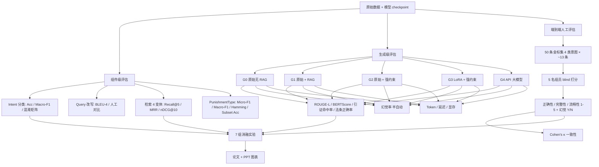

# 09 · 评估策略（团队成员）

## 策略目标

建立一套**可复现、可对外汇报、可支撑论文图表**的三级评估体系，覆盖：
1. **组件级**（单模块指标，便于归因）
2. **生成级**（5 组对照，回答赛道 B 的 LoRA 前后 + 幻觉缓解要求）
3. **端到端**（50 条金标集 + 5 人 blind 人工打分，回答"用户真的满意吗"）

另外交付 **7 组消融实验**，满足课程"baseline 对比 + 消融实验 ≥5 组"的硬性要求，并显式验证每一条链路决策。

## 输入 / 输出

| 项 | 内容 |
| --- | --- |
| 输入 | `event_corpus.jsonl` / `event_chunks.jsonl` / 模型 checkpoint / 意图标注集 / PunishmentType 多标签集 / 50 条金标集 |
| 输出 | `artifacts/eval/component_*.json` / `artifacts/eval/generation_matrix.json` / `artifacts/eval/end_to_end_scores.json` / `artifacts/eval/ablation_table.csv` / `docs/reports/eval_figs/*.png` |

## 评估层级图



## 三级评估指标表

### L1 · 组件级

| 模块 | 指标 | 数据集 | 阈值 / 目标 |
| --- | --- | --- | --- |
| 意图分类（7 类） | Accuracy, Macro-F1, 混淆矩阵 | `data/intent/{train,val,test}.jsonl` | Macro-F1 ≥ 0.85 |
| Query 改写 | BLEU-4, 人工 A/B 胜率 | 100 条 query · 原始 vs 改写 | 人工胜率 ≥ 60% |
| 检索 BM25 | Recall@5, MRR, nDCG@10 | 300 条事件自举 + 50 条金标 | R@5 ≥ 0.55 |
| 检索 Dense | 同上 | 同上 | R@5 ≥ 0.65 |
| 检索 Hybrid (RRF) | 同上 | 同上 | R@5 ≥ 0.75 |
| Hybrid + Reranker | 同上 | 同上 | R@5 ≥ 0.85, nDCG@10 ≥ 0.80 |
| PunishmentType TF-IDF baseline | Micro-F1, Macro-F1, HammingLoss, SubsetAcc | `data/party_test.jsonl` | Micro-F1 ≥ 0.55 |
| PunishmentType MacBERT | 同上 | 同上 | Micro-F1 ≥ 0.70 |

### L2 · 生成级（5 组对照）

| 组 | 配置 | 目的 |
| --- | --- | --- |
| G0 | Qwen2.5-1.5B 原模型，**无 RAG**，仅问题 | 判断"无外部知识"基线幻觉 |
| G1 | 原模型 + RAG（Hybrid+Rerank Top5） | 验证 RAG 的收益 |
| G2 | 原模型 + RAG + **强证据约束 Prompt** | 验证 prompt 工程的增益 |
| G3 | **LoRA 微调后** + RAG + 强证据约束 | 赛道 B 硬性要求：前后对比 |
| G4 | API 大模型（DeepSeek-V3 / Qwen-Max）+ RAG + 强证据约束 | 天花板参考，说明差距 |

自动指标：
- **ROUGE-L**（中文以字符级切分 + jieba 双口径）
- **BERTScore-F1**（`bert-base-chinese`）
- **引证命中率** = 模型引用的 EventID / 法条 在 Top-K 证据集合中的比例
- **法条正确率** = 输出法条（regex 抽取"《XXX》第 X 条"）与金标法条集合交集 / 金标并集（Jaccard）

半自动指标：
- **幻觉率** = ∑(回答包含证据外的案例编号 / 当事人 / 法条条目) / N_samples
  - 自动过滤：regex 抽取 EventID / 当事人 / 法条 → 比对检索证据集合
  - 2 名标注员 double-check 边界样本

成本指标：
- 平均 prompt token / completion token（`tiktoken` 或 `transformers` tokenizer）
- 平均推理延迟（秒 / 请求，batch=1，本机 CPU 与 Colab T4 分别报一次）
- 峰值显存 / 内存（`torch.cuda.max_memory_allocated`，CPU 侧报常驻 RSS）

### L3 · 端到端人工评估

- **评测集规模**：50 条，按 4 类 in-scope 意图分层采样（`case_retrieval` / `law_grounding` / `sanction_recommendation` / `trend_analysis` 各 ~13 条），另外随机混入 5 条 `out_of_scope` / `chitchat` 做拒答检测（不计入 50 条正题，作为陷阱集）。
- **采样策略**：Test 切片（2024-2025）优先 → 覆盖 8 大 ViolationType → 覆盖 Top-10 高频 PunishmentType → 覆盖 3 档罚款量级。
- **每条标注内容**：见下文 JSON schema。
- **5 人 blind 打分**：打分前隐藏模型 ID（随机化 G0-G4 顺序 + 盲 label），每人独立打全部 50×5 = 250 条。
- **评分维度**：
  - 正确性 Correctness 1-5（事实是否与金标一致）
  - 完整性 Completeness 1-5（是否覆盖金标关键信息）
  - 流畅性 Fluency 1-5（中文自然度 + 法律术语准确）
  - 幻觉 Hallucination Yes/No（是否出现证据外编造）
- **一致性**：对每一维度计算 **Cohen's κ**（两两配对 10 组取平均 → Fleiss' κ 作为辅助），要求 κ ≥ 0.6 视为可信；若低于阈值，召集对齐会重新标注 20%。

## 7 组消融实验设计表

| # | 消融维度 | 对照组 | 固定变量 | 关注指标 | 对应策略决策 |
| --- | --- | --- | --- | --- | --- |
| A1 | 检索算法 | BM25 / Dense / Hybrid(RRF) | 相同 Top-20 候选 + 相同 Query | Recall@5, MRR, nDCG@10 | 03-检索策略 |
| A2 | 是否 Rerank | Hybrid / Hybrid+Reranker | Top-20→Top-5 | Recall@5, nDCG@10, 延迟 | 03-检索策略 |
| A3 | Query 改写 | Raw / Rewritten | 同一 Hybrid+Rerank | Recall@5, 端到端正确性 | 02-Query 改写 |
| A4 | 元数据硬过滤 | On / Off | Hybrid+Rerank + LoRA | Recall@5, 噪声案例占比 | 03-检索 / 04-元数据 |
| A5 | LoRA 微调 | 原模型 / LoRA | G2 vs G3 | BERTScore-F1, 幻觉率, 法条正确率 | 05-微调 |
| A6 | 强证据 Prompt | 无约束 / 强约束 | G1 vs G2 | 幻觉率, 引证命中率 | 06-Prompt |
| A7 | Top-k chunk | k=3 / k=5 / k=8 | G3 固定 | ROUGE-L, 延迟, token 成本 | 03-检索 |

## 人工标注协议模板

### 评测集单条 JSON schema（`data/eval/gold_50.jsonl`）

```json
{
  "gold_id": "GOLD-0001",
  "intent": "case_retrieval",
  "sub_type": "按当事人查",
  "question": "请查询 2024 年涉及"信息披露违规"的行政处罚案例，给出当事人、处罚金额和处罚措施。",
  "gold_answer": "2024 年 xx 公司因信息披露违规被罚 xxx 万元，责令改正并予以警告……",
  "gold_event_ids": ["EVT-2024-00123", "EVT-2024-00456"],
  "gold_laws": ["《证券法》第七十八条", "《信息披露管理办法》第三条"],
  "gold_punishment_types": ["罚款", "警告"],
  "metadata": {
    "violation_type": "信息披露违规",
    "year": 2024,
    "fine_bucket": "100-500万",
    "source_rows": ["row_idx=12034", "row_idx=12578"]
  },
  "difficulty": "medium",
  "trap": false,
  "notes": "罚款金额需合并两次决定；允许任一合法引用"
}
```

### 人工打分记录 schema（`data/eval/human_scores.jsonl`）

```json
{
  "gold_id": "GOLD-0001",
  "model_label": "M3",
  "true_model": "G3_lora_strict",
  "annotator": "anno_03",
  "correctness": 4,
  "completeness": 3,
  "fluency": 5,
  "hallucination": false,
  "hallucination_evidence": "",
  "comment": "漏掉第二笔罚款，但主案例正确",
  "timestamp": "2026-04-22T10:15:00+08:00"
}
```

### 标注操作规范
1. 打分前**关闭 git diff / 文件夹窗口**，只看 `model_label` 不看 `true_model`。
2. 顺序通过 `random.seed(anno_id)` 对每个 annotator 独立打乱。
3. 遇到 trap 样本（`out_of_scope`）要求模型必须拒答，拒答计 correctness=5，未拒答计 0。
4. 每位打完后提交 `human_scores.jsonl`，由 团队成员 合并去重并计算 κ。

## 与上下游接口约定

| 上游 | 接口 |
| --- | --- |
| 01 · 意图识别 | 消费 `data/intent/test.jsonl` + `artifacts/intent/test_pred.jsonl` |
| 02 · Query 改写 | 消费 `artifacts/rewrite/test_pairs.jsonl`（`raw` / `rewritten`） |
| 03 · 检索 | 调用 `RetrievalEngine.search(query, mode=...)`，`mode ∈ {bm25, dense, hybrid, hybrid_rerank}` |
| 05 · 微调 | 消费 `artifacts/lora/adapter/` + 原模型路径 |
| 06 · Prompt | 消费 `src/csrc_rag/generation/prompts/*.jinja` |

| 下游 | 接口 |
| --- | --- |
| 论文 & PPT | 直接读 `artifacts/eval/*.json` + `docs/reports/eval_figs/*.png` |
| Demo | 在 web 前端展示最新一次端到端打分摘要（只读） |

## 风险与兜底

| 风险 | 概率 | 影响 | 兜底 |
| --- | --- | --- | --- |
| BERTScore 下载模型失败 | 中 | 生成评估缺指标 | 降级到 ROUGE-L + 人工 |
| 5 人打分不齐 | 中 | 人工指标不可信 | 至少保证每条 3 人打分 + 报告 κ |
| API 大模型 G4 被限额 | 低 | 天花板缺失 | 以"已跑 20 条子样本 + 置信区间"报告 |
| 50 条金标标注慢 | 高 | 端到端评估延期 | 先用 20 条跑通 + 后续补齐 30 条 |
| 幻觉 regex 漏检 | 中 | 幻觉率偏低 | 抽 20% 做人工 double-check，报两列（auto / adj） |

## 产出清单

- `scripts/evaluate_generation.py` · 生成级 5 组对照评估（自动 + 半自动指标）
- `scripts/evaluate_end_to_end.py` · 端到端评估（导入人工打分 + 计算 κ）
- `scripts/evaluate_retrieval_sanity.py` · 已存在，作为 L1 检索的基础
- `data/eval/gold_50_template.jsonl` · 50 条评测集模板 + 5 条示例
- `artifacts/eval/*.json` · 机器可读指标（在实验跑完时产生）
- `docs/reports/eval_figs/*.png` · 论文 / PPT 所用图表（柱状、雷达、混淆矩阵、消融折线）
