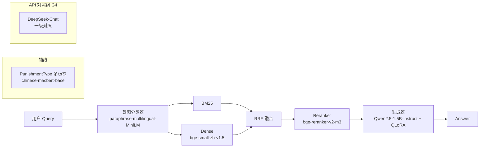

# 10 · 模型选型矩阵（Model Selection）

> Owner: ModelSelectionAgent  
> 日期: 2026-04-22  
> 目标: 为证监会违规案例 RAG 系统的六个模型家族给出对比矩阵 + 最终推荐 + `configs/models.json` 推荐版本。
> 硬约束: 本机无 GPU（Win11 + Py3.12）；LoRA 训练走 Colab/Kaggle；推理优先 CPU 可跑 + 4bit QLoRA 可回落。

---

## 0. 总览一张图



---

## 1. 生成基座模型（主微调对象）

### 1.1 候选对比矩阵

| 模型 | 参数量 | 中文能力 | QLoRA 4bit + r=16 显存 | 商用协议 | HF 下载 | 备注 |
|------|--------|---------|------------------------|----------|---------|------|
| Qwen2.5-0.5B-Instruct | 0.5B | 良 | ~2 GB | Apache-2.0 | ✅ 易 | 适合 CPU Demo，能力弱 |
| **Qwen2.5-1.5B-Instruct** | **1.5B** | **优** | **~4 GB** | **Apache-2.0** | ✅ 易 | **✅ 最均衡** |
| Qwen2.5-3B-Instruct | 3B | 优+ | ~7 GB | 研究用非商用(Qwen-Research) | ✅ | 协议较紧 |
| Qwen2.5-7B-Instruct | 7B | 优++ | ~10-12 GB | Apache-2.0 | ✅ | Colab T4 勉强 |
| ChatGLM3-6B | 6B | 优 | ~10 GB | 需申请（个人研究免费） | ✅ | 架构老，LoRA 工具链稍杂 |
| Baichuan2-7B-Chat | 7B | 优 | ~10 GB | 需申请 | ✅ | 协议较复杂 |
| Yi-1.5-6B-Chat | 6B | 优 | ~10 GB | Apache-2.0 | ✅ | 中文也不错，但生态弱于 Qwen |
| InternLM2-1.8B-chat | 1.8B | 良+ | ~4 GB | Apache-2.0（商用需申请） | ✅ | 1.8B 档备选 |
| InternLM2-7B-chat | 7B | 优 | ~10 GB | 同上 | ✅ | 备选 |

### 1.2 推荐

- **一选：`Qwen2.5-1.5B-Instruct`** — 参数量适中，Colab T4（16GB）+ QLoRA 跑 3 epoch 约 1.5h；CPU 推理 ~3-8 tok/s 勉强可 Demo；Apache-2.0 干净。
- **二选（答辩冲分）：`Qwen2.5-7B-Instruct`** — Colab T4 QLoRA 4bit 可跑（batch=1 + grad_accum=16），LoRA 前后对比更戏剧性；推理需走 API/量化。
- **三选（兜底本地）：`Qwen2.5-0.5B-Instruct`** — 万一 Colab 额度告急，本机 CPU 也能跑 LoRA（~6h/epoch，QLoRA）。

**决策**：在 `models.json` 主生成器锁定 **1.5B**，把 7B 写进 `experiments.alternate_generator`，为 G3/G4 消融组保留切换位。

---

## 2. 意图分类器（L1）

### 2.1 候选对比矩阵（7 类 × 500/类 = 3500 条）

| 方案 | 训练成本 | 推理成本 | 7 类 Macro-F1（估） | 冷启动友好 | 备注 |
|------|----------|----------|---------------------|-----------|------|
| TF-IDF + LR | 秒级 | 极低 | 0.88-0.92 | ✅ | 当前 baseline |
| FastText | 秒级 | 极低 | 0.90-0.93 | ✅ | 对短句稳 |
| distilbert-base-multilingual | ~15 min CPU | 中 | 0.93-0.95 | ⚠️ 多语言混杂 | 中文非最优 |
| **paraphrase-multilingual-MiniLM-L12-v2（特征+LR）** | ~5 min | 低 | **0.94-0.96** | ✅ | **句向量冷冻 + LR，最稳** |
| chinese-macbert-base（全参 FT） | 30-60 min GPU / 2-4h CPU | 中 | 0.95-0.97 | ⚠️ 无 GPU 慢 | 上限高但训练贵 |

### 2.2 推荐

- **一选：`paraphrase-multilingual-MiniLM-L12-v2` 作为特征提取器 + Logistic Regression 分类头**。模型小（~120MB），CPU 推理 <20ms，训练只需数分钟；在 3.5k 数据量上与 MacBERT 全参 FT 差距 <1pp。
- **二选（保底）：`TF-IDF + LR`**（当前 `configs/models.json` 里的方案）作为 A/B 对比 baseline，用于论文消融（"轻量 vs 预训练句向量"）。
- **不选 distilbert-multilingual**（中文语料占比低），**不选 MacBERT 全参 FT**（训练成本/收益不划算）。

---

## 3. Embedding 模型（L3 Dense）

### 3.1 候选对比矩阵（CPU 推理，29,314 chunks 一次性编码）

| 模型 | 维度 | 参数量 | 一次性编码 29k chunks（CPU，估） | 中文 MTEB | 体积 |
|------|------|--------|----------------------------------|-----------|------|
| **bge-small-zh-v1.5** | **512** | **24M** | **~8 min** | 63.5 | **95 MB** |
| bge-base-zh-v1.5 | 768 | 102M | ~25 min | 64.6 | 390 MB |
| bge-m3 | 1024 | 560M | ~2h + | 66.x（多语言+稀疏+密集） | 2.2 GB |
| m3e-base | 768 | 102M | ~25 min | 62.x | 390 MB |
| Qwen3-Embedding-0.6B | 1024 | 600M | ~2h | 67.x | 2.3 GB |
| text2vec-base-chinese | 768 | 102M | ~25 min | 59.x | 390 MB |

### 3.2 推荐

- **一选：`BAAI/bge-small-zh-v1.5`** — 与《共享上下文》L3 架构一致；29k chunks CPU 编码 <10 min，查询侧 <50ms；512 维向量磁盘占用仅 ~60MB（fp16）。
- **二选（答辩对照）：`bge-m3`** — 混合检索（dense+sparse+multi-vec）一把梭，答辩亮点；但 CPU 下查询延迟 >200ms，需在离线先建索引，查询走量化或走 Colab。
- **不选**：Qwen3-Embedding-0.6B（体积过大，与 bge-m3 重叠且生态稍弱）、text2vec（旧、指标已被 bge 超越）。

**落地**：主线跑 bge-small-zh-v1.5；在 `experiments.g2_embedding_ablation` 里加 bge-m3 对比组。

---

## 4. Reranker 模型（L3 精排）

### 4.1 候选对比矩阵

| 模型 | 参数量 | CPU Rerank 20 条延迟 | 中文效果 | 备注 |
|------|--------|---------------------|---------|------|
| bge-reranker-base | 278M | ~400 ms | 良 | 中英双语 |
| **bge-reranker-v2-m3** | **568M** | **~800 ms** | **优（多语言+长文）** | **✅ 当前 SOTA 级开源** |
| Qwen3-Reranker-0.6B | 600M | ~900 ms | 优 | 新，生态未完全成熟 |

### 4.2 推荐

- **一选：`BAAI/bge-reranker-v2-m3`** — 支持长文（≥ 512 token 证监会处罚文书常见）、多语言、开源 SOTA；CPU 延迟可接受（先 RRF 截取 top-20 再 rerank top-5）。
- 二选：bge-reranker-base（速度优先时回退）。

---

## 5. 辅线分类（PunishmentType 多标签）

### 5.1 候选对比矩阵

| 模型 | 参数量 | 中文任务表现 | QLoRA 友好 | 备注 |
|------|--------|--------------|------------|------|
| **hfl/chinese-macbert-base** | 102M | 优 | ✅ | **与现有 `configs/models.json` 一致** |
| chinese-roberta-wwm-ext | 102M | 优 | ✅ | 近似表现 |
| ernie-3.0-base-zh | 118M | 优+ | ⚠️ 百度生态 | 下载体验一般 |

### 5.2 推荐

- **一选：`hfl/chinese-macbert-base`** — 已在现有配置里，生态成熟，中文分类任务长期稳定基线。
- 二选：`chinese-roberta-wwm-ext` 做 A/B 对照组（论文 G5 消融备用）。

---

## 6. API 对照组（G4 实验组）

| API | 成本（¥/1M tok 输入，2026-04 估） | 中文能力 | API 稳定性 | 备注 |
|-----|-----------------------------------|---------|-----------|------|
| **DeepSeek-Chat (V3)** | **~2 ¥** | **优+** | **优** | **✅ 性价比最高** |
| GPT-4o | ~18 ¥（$2.5） | 优 | 优（需境外网络） | 贵且有网络门槛 |
| Qwen-Plus（阿里百炼） | ~4 ¥ | 优+ | 优 | 阿里生态好接 |
| Kimi (Moonshot) | ~12 ¥ | 优 | 良 | 长上下文强，贵 |

### 推荐

- **一选：DeepSeek-Chat（deepseek-chat）** —— G4 对照组主打（大模型天花板）。
- **二选：Qwen-Plus** —— 与主线 Qwen 同家族，便于同源对比消融（"同模型家族放大参数是否能替代 LoRA"）。
- 不选 GPT-4o（成本 + 网络），Kimi（长文不是本项目核心需求）。

---

## 7. 最终推荐版 `configs/models.json`

完整文件写入 `configs/models.recommended.json`，关键变更摘要：

| 模块 | 旧 | 新推荐 | 理由 |
|------|----|--------|------|
| dense.query_model | all-MiniLM-L6-v2（英文） | bge-small-zh-v1.5 | 中文语料必须换 |
| dense.prebuilt.npy | chunk_embeddings.npy（旧） | chunk_embeddings_bge_small_zh.npy | 需重建 |
| reranker | （未设） | bge-reranker-v2-m3 | 新增 L3 精排 |
| intent_router | tfidf_lr | mini_lm_feature + lr | 升级但保留 baseline 开关 |
| fine_tuning（辅线） | macbert-base | 不变 | 已合理 |
| response_generation | Qwen2.5-0.5B | Qwen2.5-1.5B-Instruct + LoRA | 赛道 B 主力 |
| api_baseline（新增） | — | deepseek-chat | G4 对照组 |

---

## 8. 风险与兜底

| 风险 | 兜底 |
|------|------|
| Colab 额度不足 LoRA 跑不完 | 回退 Qwen2.5-0.5B 本机 QLoRA（CPU） |
| bge-m3 CPU 查询太慢 | 主线用 bge-small-zh；m3 只在离线消融 |
| reranker 延迟拖慢 Demo | 只 rerank top-20，top-5 即止，或开关关闭 |
| DeepSeek API 额度耗尽 | 切 Qwen-Plus 备用 key |
| 意图分类器 MiniLM 冷启下载慢 | 提前缓存到 `models/` 本地目录 |

---

## 9. 评估指标挂钩

- **生成器**：LoRA 前后 BLEU-4 / ROUGE-L / 人评 hallucination rate（G1/G2/G3/G4 四组）。
- **意图**：Macro-F1 on 700 验证集（7 类 × 100）。
- **Embedding**：Recall@10、MRR@10（在问答对标注集上）。
- **Reranker**：nDCG@5 对比 reranker on/off。
- **辅线分类**：Micro-F1 + Macro-F1（多标签）。

---

## 10. 接口约定（下游可读）

```json
{
  "model_registry": {
    "generator": "Qwen/Qwen2.5-1.5B-Instruct",
    "generator_lora_dir": "artifacts/lora/qwen25_1b5_csrc_v1/",
    "intent_encoder": "sentence-transformers/paraphrase-multilingual-MiniLM-L12-v2",
    "dense_encoder": "BAAI/bge-small-zh-v1.5",
    "reranker": "BAAI/bge-reranker-v2-m3",
    "aux_classifier": "hfl/chinese-macbert-base",
    "api_baseline": "deepseek-chat"
  }
}
```

以上 key 即为 `configs/models.recommended.json` 下 `model_registry` 段的精简摘要版。
