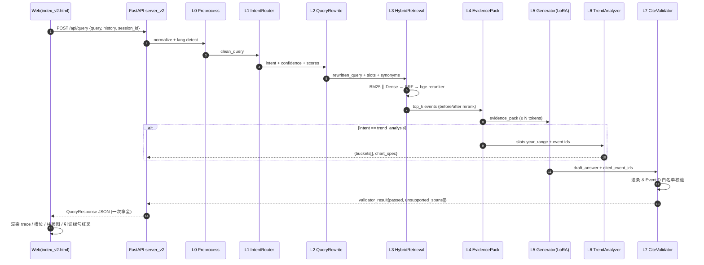
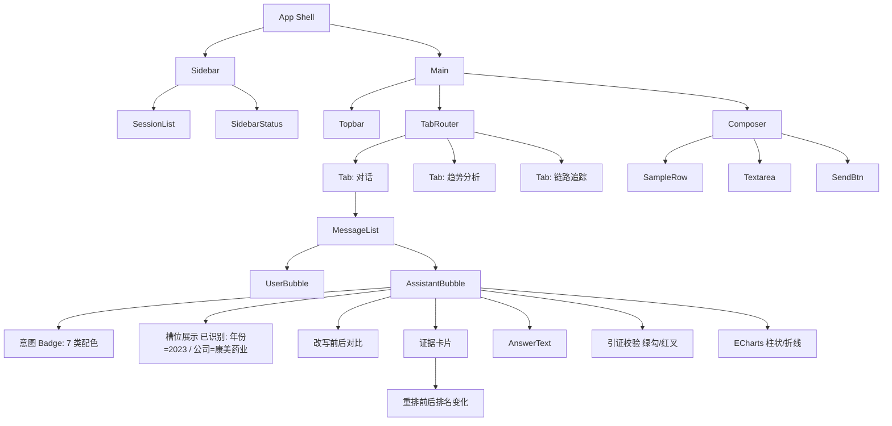

# 11 · Engineering Strategy（前后端工程链路整改方案）

> Owner: 工程组（前后端工程链路）  
> 项目统筹 合稿 input · 与 L0–L7 各策略对齐（01 拒答 / 03 query 改写 / 07 response / 10 模型选型）  
> 目标：把当前 `scripts/run_demo_server.py` + `web/index.html` 的「三层链路 MVP」升级为**七层可视化答辩 Demo**。

---

## 0. 策略目标

1. 让**七层链路 L0–L7 全部可观测**：前端能看到「改写前/后 query、槽位、召回、重排前后排名、引证校验结果」。
2. 后端切 **FastAPI**（Pydantic 校验 + 自动 OpenAPI + 异步），保留旧 `http.server` 作为离线回退。
3. API 一次请求返回**一次推理的全部中间态**（面向答辩演示，不是面向生产），方便前端做「链路可视化」。
4. **降级优先 > 正确性优先 > 速度优先**：任何一层失败都不能让整条链路 500。
5. 所有可变配置走 **环境变量 + `configs/*.json`**，不碰代码。

---

## 1. 为什么切 FastAPI

| 维度 | 现状 `http.server` | 目标 FastAPI |
|------|--------------------|--------------|
| 请求/响应校验 | 手写 `parse_qs / json.loads` | Pydantic v2 自动校验 + 422 错误体 |
| 文档 | 无 | `/docs` OpenAPI + Swagger |
| 异步 | 同步阻塞 | `async def` + 生成/重排并发 |
| 流式（SSE） | 不支持 | `StreamingResponse` 支持 L5 token 流 |
| 静态资源 | `SimpleHTTPRequestHandler` | `StaticFiles` 挂 `/` 到 `web/` |
| 测试 | 手写 | `TestClient`（无需起服务） |

> **结论**：切。新增 `src/csrc_rag/api/server_v2.py`，旧 `scripts/run_demo_server.py` 保留不动，用 `start.bat --legacy` 触发回退。

---

## 2. 端到端调用图（mermaid）



---

## 3. REST API 契约

### 3.1 Endpoints 总览

| Method | Path | 用途 |
|--------|------|------|
| `GET`  | `/api/health` | 健康检查（含 model 就绪态） |
| `POST` | `/api/query` | **主入口**：一次拿全 L0–L7 |
| `POST` | `/api/query/stream` | SSE 流式（L5 token 流 + L7 结果 after-event） |
| `GET`  | `/api/intents` | 七类意图及其 prompt / top_k 配置 |
| `GET`  | `/api/trend?year_from=&year_to=&violation=` | L6 独立调用（前端独立「趋势页」用） |
| `POST` | `/api/feedback` | 答辩时评委点「👍/👎」→ 写日志 |
| `GET`  | `/api/debug/last` | 最近一次请求的完整 trace（只在 `DEBUG=1` 时开放） |

### 3.2 `/api/query` 请求 schema（≥ 20 字段）

```json
{
  "query": "2023 年康美药业有哪些信息披露违规案件？",
  "session_id": "sess-ab12cd",
  "history": [
    { "role": "user", "content": "..." },
    { "role": "assistant", "content": "..." }
  ],
  "options": {
    "forced_intent": null,
    "retrieval_mode": "hybrid",
    "top_k": 8,
    "rerank": true,
    "strict_citation": true,
    "stream": false,
    "enable_trend": true,
    "enable_validator": true,
    "lora_adapter": "qwen2.5-1.5b-csrc-lora-v1",
    "max_new_tokens": 512,
    "temperature": 0.2,
    "seed": 42,
    "lang": "zh",
    "debug": false
  }
}
```

### 3.3 `/api/query` 响应 schema（≥ 20 字段）

```json
{
  "success": true,
  "request_id": "req-7f8e90",
  "session_id": "sess-ab12cd",
  "timings_ms": {
    "l0_preprocess": 1,
    "l1_intent": 18,
    "l2_rewrite": 34,
    "l3_retrieval": 142,
    "l3_rerank": 88,
    "l4_pack": 4,
    "l5_generate": 2105,
    "l6_trend": 21,
    "l7_validate": 9,
    "total": 2422
  },

  "intent": "case_retrieval",
  "intent_confidence": 0.91,
  "intent_method": "sklearn+rules",
  "intent_scores": { "case_retrieval": 0.91, "law_grounding": 0.06, "...": 0.0 },

  "query_original": "2023 年康美药业有哪些信息披露违规案件？",
  "query_rewritten": "2023 年 康美药业 信息披露 违规 处罚 案例",
  "slots": {
    "year": 2023,
    "year_range": [2023, 2023],
    "company": "康美药业",
    "violation_type": "信息披露违规",
    "is_listed_company": true,
    "regulator_hint": null
  },
  "synonyms_expanded": ["信息披露违规", "披露不实", "虚假陈述", "未按规定披露"],

  "query_plan": {
    "retrieval_unit": "event",
    "top_k": 8,
    "candidate_pool": 80,
    "rrf_k": 60,
    "metadata_filters": { "year": 2023, "is_listed_company": true }
  },

  "retrieval_trace": {
    "bm25_top": [ { "event_id": "E12345", "score": 18.7 } ],
    "dense_top": [ { "event_id": "E12345", "score": 0.73 } ],
    "fused_top": [ { "event_id": "E12345", "score": 0.061 } ],
    "rerank_top": [ { "event_id": "E12345", "score": 0.98, "rank_before": 3, "rank_after": 1 } ]
  },

  "events": [
    {
      "event_id": "E12345",
      "title": "康美药业信息披露违规案",
      "score": 0.98,
      "declare_date": "2023-07-12",
      "promulgator": "证监会",
      "punishment_types": ["罚款", "警告"],
      "laws": ["《证券法》第一百九十七条"],
      "snippets": ["..."],
      "rank_before_rerank": 3,
      "rank_after_rerank": 1
    }
  ],

  "answer": "2023 年康美药业…（正文）…",
  "cited_event_ids": ["E12345", "E12346"],
  "cited_laws": ["《证券法》第一百九十七条"],

  "validator_result": {
    "passed": true,
    "coverage": 0.92,
    "unsupported_spans": [],
    "missing_citations": [],
    "hallucinated_law_refs": []
  },

  "trend": {
    "enabled": false,
    "buckets": [],
    "chart_spec": null
  },

  "response_backend": "qwen2.5-1.5b-lora",
  "response_model": "Qwen2.5-1.5B-Instruct + LoRA v1",
  "degraded": false,
  "degraded_reason": null,
  "warnings": [],
  "error": null
}
```

> 字段清单（26 个顶层）：`success, request_id, session_id, timings_ms, intent, intent_confidence, intent_method, intent_scores, query_original, query_rewritten, slots, synonyms_expanded, query_plan, retrieval_trace, events, answer, cited_event_ids, cited_laws, validator_result, trend, response_backend, response_model, degraded, degraded_reason, warnings, error`。

---

## 4. 前端改造

### 4.1 组件树（mermaid）



### 4.2 意图 Badge 7 类配色

| 意图 | 颜色 | 文案 |
|------|------|------|
| `greeting` | #94a3b8 灰蓝 | 寒暄 |
| `chitchat` | #cbd5e1 浅灰 | 闲聊 |
| `out_of_scope` | #ef4444 红 | 超纲 |
| `case_retrieval` | #2563eb 蓝 | 案例检索 |
| `law_grounding` | #7c3aed 紫 | 法规依据 |
| `sanction_recommendation` | #d97706 琥珀 | 处罚推荐 |
| `trend_analysis` | #059669 绿 | 趋势分析 |

### 4.3 关键 UI 模块

1. **槽位条（SlotsPanel）** – 灰底 pill：`年份 2023` `公司 康美药业` `违规类型 信息披露`；未识别的字段灰显「未识别」。
2. **重排前后排名差**（RerankDiff） – 在每张证据卡右上角显示 `#3 → #1 ▲2` 或 `#1 → #4 ▼3`。
3. **引证校验（ValidatorBadge）**：
   - `passed=true && coverage >= 0.8` → 绿勾 `✓ 引证通过 92%`
   - `passed=false || coverage < 0.5` → 红叉 `✗ 存在 2 处未支撑陈述`（悬浮弹框列 unsupported_spans）
4. **趋势页（TrendView）** – 切到 ECharts（UMD CDN，换掉 chart.js）：柱状图（逐年案件数）+ 折线图（累计处罚金额）+ 年份 slider。
5. **链路追踪页（TraceView）** – 只在 `debug=true` 时显示：L0 → L7 横向 timeline，每段上标 `timings_ms`，点开看该层原始 JSON。

### 4.4 前端请求示例（TS 化后的 fetch）

```typescript
interface ApiResponse<T> {
  success: boolean
  data?: T
  error?: string
}

interface QueryResponse {
  request_id: string
  intent: Intent
  slots: Record<string, unknown>
  // ... 见 3.3
}

async function queryRag(body: QueryRequest): Promise<QueryResponse> {
  const res = await fetch('/api/query', {
    method: 'POST',
    headers: { 'Content-Type': 'application/json' },
    body: JSON.stringify(body),
  })
  if (!res.ok) throw new Error(`HTTP ${res.status}`)
  return res.json() as Promise<QueryResponse>
}
```

---

## 5. Demo 可视化脚本（答辩现场跑的 4 幕）

| 幕 | 口播 | 前端展示 |
|----|------|----------|
| 第 1 幕 | 「看意图识别」 | 输入「你好」→ `greeting` 灰蓝 badge，直接模板回复 |
| 第 2 幕 | 「看案例检索 + 重排」 | 输入「2023 年康美药业…」→ 槽位条高亮 `年份=2023 / 公司=康美药业`；证据卡显示「#3 → #1 ▲2」 |
| 第 3 幕 | 「看生成 + 引证校验」 | 切到答案区；validator badge 绿勾「引证通过 92%」；如果故意删掉证据 → 红叉「未支撑陈述 2 处」 |
| 第 4 幕 | 「看趋势分析」 | 切到「趋势分析」页；ECharts 柱状图 2019–2025 案件数；下方列逐年 top-3 违规类型 |

---

## 6. 降级方案清单

| 层 | 失败场景 | 降级动作 | 用户可见反馈 |
|----|----------|----------|--------------|
| L0 | 输入为空/超长（>2k 字） | 截断至 2000，追加 `warnings: ["query_truncated"]` | 前端黄条提示 |
| L1 | 意图分类失败 / 模型未加载 | fallback 到 `rule_based` 正则；再失败用 `case_retrieval` 默认 | badge 显示「意图:case_retrieval (rule)」 |
| L2 | 改写失败 / LLM 不可用 | `query_rewritten = query_original`，`synonyms_expanded = []` | 改写面板显示「未改写（已降级）」 |
| L3 | 索引未加载 / BM25 ∥ Dense 都 0 命中 | 1) 去 filter 重查 2) 仍 0 → 返回固定话术 | 证据卡显示「未命中任何证据，已降级为通用回复」 |
| L3 Rerank | reranker 不可用 | 跳过重排，`rank_after_rerank = rank_before_rerank` | 证据卡不显示 `▲▼` 差异 |
| L4 | 证据超 token 预算 | 按 score 降序截断 + 摘要化（取前 220 字） | `warnings: ["evidence_truncated"]` |
| L5 | 生成超时（> 15s） / OOM | 返回模板式回复 `TemplateResponder` | `response_backend = "template_fallback"`，degraded=true |
| L5 | LoRA adapter 加载失败 | 降级到 base Qwen2.5 无 LoRA | `response_model` 显示 `Qwen2.5-1.5B (no-lora)` |
| L6 | 趋势分析无数据 | `trend.enabled=false, buckets=[]` | 趋势页显示「该条件下暂无数据」 |
| L7 | 引证校验失败 / 超时 | `validator_result.passed=null`（未知） | badge 显示「⚠ 校验跳过」 |
| 全局 | 未知异常 | 500 返回 `{success:false, error, degraded:true}` | 前端红条 toast |

> **原则**：每层 degrade 都返回可用结果，不让整条链路抛；`degraded=true` 用于答辩现场红色警告可视化（加分项：「看，我们主动暴露了降级」）。

---

## 7. 部署脚本改造

### 7.1 环境变量表

| 变量 | 默认 | 说明 |
|------|------|------|
| `CSRC_HOST` | `127.0.0.1` | 绑定 host |
| `CSRC_PORT` | `8000` | 绑定 port |
| `CSRC_RETRIEVAL_MODE` | `hybrid` | `bm25` / `dense` / `hybrid` |
| `CSRC_LORA_ADAPTER` | _(空)_ | LoRA 权重目录；空 = 不加载 |
| `CSRC_GENERATE_BACKEND` | `template` | `template` / `qwen-local` / `qwen-lora` |
| `CSRC_RERANK_ENABLED` | `1` | 0 关重排 |
| `CSRC_DEBUG` | `0` | 1 开 `/api/debug/last` |
| `CSRC_LOG_LEVEL` | `INFO` | 日志级别 |
| `CSRC_MAX_TOKENS` | `512` | 生成最大 token |
| `CSRC_ALLOW_ORIGINS` | `*` | CORS |

### 7.2 `start.bat`（新版）

```bat
@echo off
chcp 65001 >nul
setlocal

if "%1"=="--legacy" (
  echo [legacy] http.server mode
  python scripts\run_demo_server.py
  goto :end
)

set CSRC_HOST=127.0.0.1
set CSRC_PORT=8000
set CSRC_RETRIEVAL_MODE=hybrid
set CSRC_GENERATE_BACKEND=template
set CSRC_RERANK_ENABLED=1
set CSRC_DEBUG=1
set CSRC_LOG_LEVEL=INFO

echo Starting CSRC RAG Demo Server (FastAPI v2)...
python -m uvicorn csrc_rag.api.server_v2:app ^
  --host %CSRC_HOST% --port %CSRC_PORT% --app-dir src --log-level info

:end
endlocal
pause
```

### 7.3 要不要上 Docker？

**结论：不做强制容器化**。理由：

- 本机 Windows + Python 3.12 已装好依赖，跑 demo 够用
- 答辩现场若断网/VPN 抽风，Docker Hub 拉镜像更危险
- **但是**：提供一份 `Dockerfile` + `docker-compose.yml` 放到 `deploy/` 作为「可选交付物」（加分项），CPU 基线镜像即可：

```dockerfile
FROM python:3.12-slim
WORKDIR /app
COPY pyproject.toml .
RUN pip install --no-cache-dir -e .
COPY src/ ./src/
COPY configs/ ./configs/
COPY data/processed/ ./data/processed/
COPY web/ ./web/
EXPOSE 8000
CMD ["uvicorn", "csrc_rag.api.server_v2:app", "--host", "0.0.0.0", "--port", "8000", "--app-dir", "src"]
```

---

## 8. 风险与兜底

| 风险 | 概率 | 影响 | 兜底 |
|------|------|------|------|
| LoRA 权重答辩前没合入 | 中 | 高 | `CSRC_GENERATE_BACKEND=template` 走模板回复，仍能演示链路 |
| bge-reranker 下载失败 | 中 | 中 | `CSRC_RERANK_ENABLED=0`，退化到 RRF 直出 |
| 现场断网 | 低 | 高 | ECharts/Chart.js 本地化到 `web/vendor/` 不走 CDN |
| Pydantic v1/v2 冲突 | 低 | 中 | `pyproject.toml` 锁 `pydantic>=2.5,<3`，CI 校验 |
| 前端 ECharts 包体积 | 低 | 低 | 走按需引入 `echarts/core + BarChart + LineChart` |
| API schema 变更 | 中 | 中 | `schemas.py` 的 `version` 字段固化，前端按 `version` 做兼容 |

---

## 9. 评估指标（工程组 口径）

| 指标 | 目标 | 测法 |
|------|------|------|
| `/api/query` P95 | < 3s（template）/ < 8s（qwen-lora CPU） | locust 10 并发打 100 req |
| 降级成功率 | ≥ 99%（任一层失败仍 200） | 单测注入失败 mock |
| API schema 覆盖 | 100% endpoint 有 pytest TestClient 用例 | `pytest --cov` |
| 前端 Lighthouse | ≥ 85 (Performance) | `npx lighthouse` |
| 链路可观测 | L0–L7 每层都有 timings_ms | 手工眼验 |

---

## 10. 与其他策略的接口点

| 上/下游 | 交付物 | 本策略怎么用 |
|---------|--------|--------------|
| `01-reject-strategy.md` | `out_of_scope` 判定函数 | L1 前置，返回 intent=out_of_scope |
| `03-query-rewrite-strategy.md` | `rewrite(query, history) -> {rewritten, slots, synonyms}` | L2 直接消费 |
| `07-response-strategy.md` | `responder.generate(...)` | L5 直接调用 |
| `10-model-selection.md` | LoRA adapter 路径 / 模型名 | 通过 `CSRC_LORA_ADAPTER` 注入 |
| `(TBD) 12-validator.md` | `validate(answer, evidence_pack) -> validator_result` | L7 直接消费 |

---

## 11. 产出清单

- [x] `docs/strategies/11-engineering-strategy.md` ← 本文档
- [x] `src/csrc_rag/api/schemas.py` ← Pydantic v2 数据模型
- [x] `src/csrc_rag/api/server_v2.py` ← FastAPI 骨架（纯签名，不启动）
- [x] `web/index_v2.html` ← 前端新版 HTML 骨架
- [ ] `web/app_v2.js` ← (下一轮) TS 化的前端逻辑
- [ ] `deploy/Dockerfile` ← (可选) 容器化
- [ ] `tests/api/test_server_v2.py` ← (下一轮) TestClient 用例

> 合稿时请 项目统筹 按需裁剪，本文档 ≈ 1600 字正文 + 多张表 / 图，供团队内部对齐；不入最终论文。
