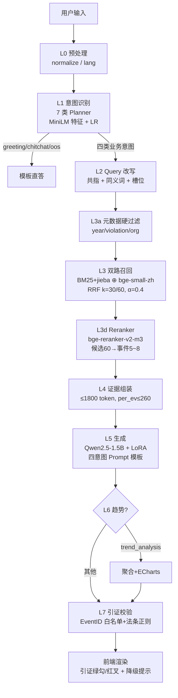
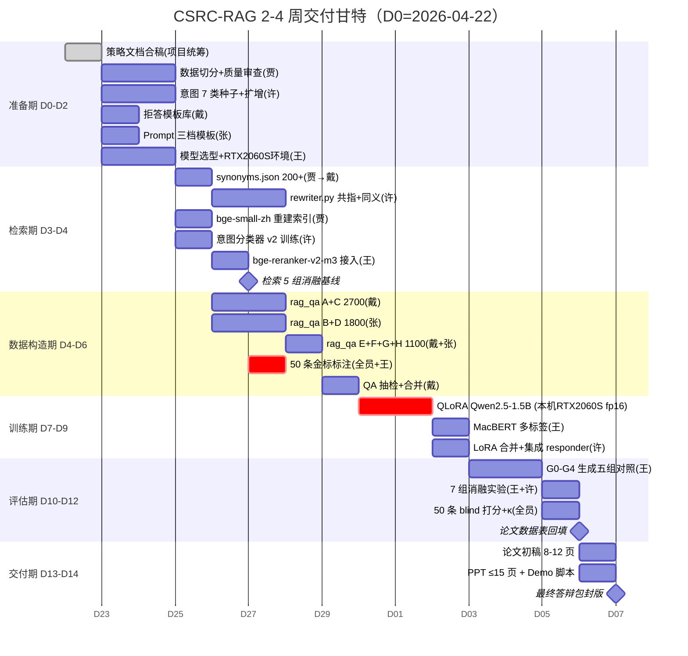

# 策略总览（项目统筹 合稿版）

> 合稿时间：2026-04-22
> 合稿来源：`docs/strategies/00-99` 共 13 份策略文档 + 用户最新拍板
> 覆盖：项目全景 · 12 策略速览 · 技术栈锁定 · 训练清单 · 冲突裁决 · 甘特 · 分工 · 风险 · 开题对齐

---

## 1. 项目一页纸

**赛道 B 独立研究**：基于 RAG 的证监会违规案例智能检索与问答系统，5 人小组 2–4 周交付。

**5 个硬约束**（不能违反）：
1. 必须展示 **LoRA 微调前后对比**（赛道 B 硬性要求）
2. 必须做 **幻觉缓解三组对照**（无 RAG / 有 RAG / 有 RAG+强证据约束）
3. 必须做 **≥5 组 baseline 消融**
4. 必须按 **EventID + 时间** 双重切分（Train 1994-2021 / Val 2022-2023 / Test 2024-2025），`PunishmentMeasure` 绝不进入模型输入
5. 必须交付 **4 件套**：8–12 页论文（含 Team Contributions + AI Contribution Statement）/ GitHub 代码仓 / ≤15 页 PPT / 可离线 Demo

**团队 5 人**：许浩财（架构+意图+集成）/ 贾彤（数据+向量库）/ 戴一鑫（问答对+拒答）/ 张彦扬（问答对+prompt）/ 王怡菲（模型选型+评估+LoRA）

---

## 2. 端到端链路全景（L0→L7）

---

## 3. 12 策略速览表

| # | 策略 | 产出物 | 核心决策（1 句话） | 关键指标 | 上游依赖 | 下游消费 |
|---|------|--------|---------------------|----------|----------|----------|
| A | 01 拒答 | `configs/reject.yaml` + 7 话术模板 | 7 类意图 + 4 级兜底（L1/L3/L5/L7），保险/银行为"软越界"单独话术 | 越界召回≥0.95, 误伤≤0.05 | J | D/G/I |
| B | 02 数据 | 6 类衍生数据 + `splits/*.event_ids.txt` | 两级索引（4,233 事件摘要 + 29,314 chunks），`PunishmentMeasure` 只进 reference 不进 input | 泄漏检查 0 交集, QA 抽检≥85% | — | D/E/H/I |
| C | 03 Query 改写 | `rewriter.py` + `synonyms.json` ≥200 对 | 规则优先 + LLM fallback；同义词分强/弱两级，强并入 OR、弱带 0.3 权重 | 槽位 F1≥0.90/0.80/0.75, Recall+5pp | B | E/I |
| D | 04 Planner | `intent_classifier_v2.pkl` + `QueryPlan` | 7 类意图升级，阶段 1 TF-IDF+LR，阶段 2 MiniLM+LR（论文主路线） | Macro-F1≥0.92, P95≤5ms | A/B | E/G/I |
| E | 05 检索 | `build_dense_index_bge.py` + `metadata_filter.py` | 先修 5 个根因（英文 embedding / 过度硬过滤 / 非 jieba tokenizer 等），目标 Recall@5 从 0.09→0.70 | Recall@5≥0.70, nDCG@10≥0.65 | B/C/J | F/G/I |
| F | 06 重排 | `reranker.py` + `config/rerank.json` | bge-reranker-v2-m3 + 业务加权（机构权威×严重性），仅 sanction 意图开 severity boost | nDCG@10≥0.80, P95≤3s | E/J | G/I |
| G | 07 生成 | `prompt_templates/*.j2` + `responder.py` hook | 四意图四模板 + 强证据 System Prompt + L7 8 条校验规则 + 3 级兜底链 | 引证命中≥95%, 幻觉≤5% | A/F/H | I |
| H | 08 LoRA | `artifacts/models/qwen_lora_csrc/` | Qwen2.5-1.5B + QLoRA(NF4, r=16, α=32, lr=2e-4, 3 epoch)；三阶段 Ablation V1/V2/V3 | BERTScore+3pp, 幻觉-5pp | B/G/J | G/I |
| I | 09 评估 | `artifacts/eval/*.json` + 50 条金标 + 7 组消融 | 三级评估（组件/生成 G0-G4/端到端 blind 打分），Fleiss' κ≥0.6 | 见本策略第 9 章 | 全员 | 论文/PPT |
| J | 10 模型选型 | `configs/models.recommended.json` | 生成 Qwen2.5-1.5B-Instruct / Dense bge-small-zh-v1.5 / Rerank bge-reranker-v2-m3 / 分类 MacBERT / API DeepSeek-Chat | — | — | C/E/F/G/H |
| K | 11 工程 | `src/csrc_rag/api/{schemas.py, server_v2.py}` + `web/index_v2.html` | FastAPI + Pydantic v2 + ECharts，26 字段一次返全链路 trace，12 层降级 | API P95<3s(template)/<8s(LoRA CPU) | E/F/G | Demo/答辩 |

---

## 4. 关键技术栈锁定（已定稿，勿再讨论）

| 层 | 模型 / 工具 | 版本 / 规格 | 来源 |
|----|-------------|-------------|------|
| 生成器 | **Qwen2.5-1.5B-Instruct** | Apache-2.0, QLoRA 4bit ≈ 4GB 显存 | 10/08 |
| Embedding | **BAAI/bge-small-zh-v1.5** | 512 维, ~95MB, CPU 编码 29k≈8min | 10/05 |
| Reranker | **BAAI/bge-reranker-v2-m3** | 568M, FP16 GPU/ONNX-INT8 CPU | 10/06 |
| 辅线分类 | **hfl/chinese-macbert-base** | PunishmentType 多标签 | 10/09 |
| 意图分类 | **MiniLM-L12-v2 特征 + LR**（主）/ TF-IDF+LR（baseline） | 特征冷冻，训练分钟级 | 10/04 |
| API 对照 G4 | **DeepSeek-Chat (V3)** | ~2¥/M tok，备选 Qwen-Plus | 10 |
| 后端 | **FastAPI + Pydantic v2 + uvicorn** | 见 `src/csrc_rag/api/server_v2.py` | 11 |
| 前端 | **HTML + ECharts (UMD)** | 7 类意图配色 badge，本地化 CDN | 11 |
| 训练环境 | **本机 RTX 2060 SUPER 8GB** (Turing) | fp16（不支持 bf16），bnb 4bit 可用但稍慢 | ⚠️ 用户拍板 |

⚠️ **重要修正**：早期文档曾写"本机无 GPU / 需 Colab"，**已过时**。实际以本机 RTX 2060 SUPER 8GB 为主训，Colab/Kaggle 作为 OOM 兜底。

---

## 5. 训练任务清单（训什么 / 多少数据 / 跑哪里）

| 任务 | 基座 | 训练数据 | 环境 | 预计时长 | 负责人 |
|------|------|----------|------|----------|--------|
| **意图分类 v2（7 类）** | MiniLM-L12-v2 + LR head | 7×500=3,500 条（30 种子 + LLM 扩 470） | 本机 CPU | < 5 min | 许浩财 |
| **PunishmentType MacBERT 多标签** | chinese-macbert-base | 14,740 当事人样本（去 PunishmentMeasure）| 本机 RTX 2060S（fp16） | ~40 min | 王怡菲 |
| **Qwen2.5-1.5B QLoRA 主训** | Qwen2.5-1.5B-Instruct | 5,360 条 8 类 QA（见下） | **本机 RTX 2060S** 或 Colab T4 兜底 | 3–5h | 王怡菲 |
| LoRA Ablation V1/V2/V3 | 同上 | V1=A+B+C (4,000) / V2=+D+E+F (5,000) / V3=+G+H (5,360) | 同上 | 各 ~3h | 王怡菲 |

**QLoRA 超参（08 文档的 bf16 改为 fp16 以适配 Turing）**：
- `quantization = NF4 + double_quant, bnb_4bit_compute_dtype=float16`（⚠️ **原 bf16 → fp16**）
- `lora_r=16, lora_alpha=32, lora_dropout=0.05, target=全部线性层`
- `per_device_batch=2`（⚠️ **原 4 → 2**，2060S 8GB 需降 batch + grad_accum=8 维持有效 16）
- `lr=2e-4, epochs=3, warmup=0.03, cosine`
- `max_seq_length=2048, gradient_checkpointing=True, optim=paged_adamw_8bit`

**rag_qa_train.jsonl 5,360 条分布**（见 08 §3）：A 案例 1,800 / B 法条 1,200 / C 处罚 1,000 / D 趋势 400 / E 拒答 300 / F 证据不足 300 / G 多轮 200 / H 反幻觉 300。

---

## 6. 11 条冲突裁决（精炼版）

| # | 冲突 | 裁决（1 句话） |
|---|------|----------------|
| C1 | 检索 chunk 短 vs LoRA context 长 | **chunk 300–500 字 + top_k=5~8 + context ≤ 2048 token**，E 用双层索引（摘要+chunk）兼顾 |
| C2 | 保险类是否全拒 | **只拒"完全无证监会案例"的硬越界**；保险/银行走 `tpl_out_of_scope_finance` 软越界文案 |
| C3 | 生成基座 1.5B vs 3B/7B | **锁定 Qwen2.5-1.5B**（2060S 8GB QLoRA 最稳），3B 走研究协议，7B 作为 `experiments.alternate_generator` |
| C4 | 同义词激进扩 vs 精准扩 | **强同义词无脑 OR，弱同义词带权 0.3**；BM25 用加权查询，Dense 用 max-pooling |
| C5 | Planner 10+ 类 vs 7 类 | **对外 7 类，case_retrieval 内部分 3 子意图**（案例/相似/机构类），D 产出双层标签 |
| C6 | Rerank 后 top_k=8 vs 5 | **默认 5，消融 3/5/8**；超长证据先 summarize 压缩 |
| C7 | 随机切 vs 时间切 | **EventID+时间三切**（1994-21/22-23/24-25），I 额外 20% 随机切做 sanity check |
| C8 | ECharts 趋势图复杂度 | **trend_analysis 先出表格+柱状图（固定模板），复杂折线放 v2** |
| C9 | epoch=3 vs 早停 | **3 epoch + val-loss 早停 patience=2**，每 epoch 存 checkpoint |
| C10 | 评估代码集中 vs 分散 | **I 提供统一评测 SDK，各 agent 只实现 `compute()`**，截止 D7 |
| C11 | 强证据 prompt 严格度 | **三档宽/中/严**，最终提交用 G3（LoRA+严格），消融展示严格度对幻觉率的影响 |

⚠️ **新增 C12（合稿时发现）**：08 QLoRA 用 `bnb_4bit_compute_dtype=bfloat16`，但用户 2060S 是 Turing 架构**不支持 bf16** → 裁决：**全链路改 fp16**，`08` 文档 bf16 字样由 项目统筹 在下一轮 patch 时替换。

⚠️ **新增 C13（合稿时发现）**：05 策略要求 Recall@5 ≥ 0.70，09 评估指标 Hybrid+Rerank 要 R@5 ≥ 0.85 → 前者为"修复后基线"、后者为"带 reranker 目标"，**不冲突**，但文档口径需统一表述。

---

## 7. D0-D14 完整甘特图

**6 关里程碑**：M1=D2 策略文档+意图 v2 / M2=D4 检索达标 / M3=D6 训练数据+评测集齐 / M4=D10 LoRA+MacBERT 训完 / M5=D12 消融+人工打分齐 / M6=D14 封版。

---

## 8. 5 人分工表

### 👨‍💻 许浩财 · 架构/意图/集成（Owner：D、K）
1. 定稿 `configs/intents_v2.json`（7 类 + 子意图）
2. 跑 `scripts/train_intent_classifier_v2.py`，验收 Macro-F1≥0.92
3. 实现 `src/csrc_rag/orchestration/planner.py`，输出 `QueryPlan`
4. 搭建 `scripts/run_pipeline.py`：意图→改写→检索→重排→生成串联
5. 合并 A/B/C/D/E 的 PR，D7 端到端 smoke test
6. D10 LoRA adapter 回本地集成进 `responder.py`（3 行 PEFT 挂载）
7. 标注 15 条 case_retrieval 金标

### 👩‍💻 贾彤 · 数据/向量库（Owner：B、E 部分）
1. `scripts/split_by_event.py` 按 EventID+时间三切
2. 校验 `event_corpus.jsonl` (4233) + `event_chunks.jsonl` (29314) 完整性
3. 下载 bge-small-zh-v1.5，跑 `scripts/build_dense_index_bge.py` 生成 `chunk_embeddings_bge.npy`
4. 整理 `configs/synonyms.json` ≥200 对交付戴一鑫
5. 联调 E Hybrid，跑 BM25/Dense/Hybrid 3 组基线表
6. 实现 `src/csrc_rag/data/quality_checker.py`（断言 PunishmentMeasure 不回流）
7. 标注 10 条 law_grounding 金标

### 👨‍💻 戴一鑫 · QA 构造/拒答（Owner：A、H 数据）
1. 定稿 `configs/reject_templates.json`（7 话术模板）
2. 写 300 条拒答负样本（E 类）+ 300 条反幻觉负样本（H 类 H1/H2/H3 各 100）
3. 主导生成 `rag_qa_train.jsonl` A+C 类共 2,700 条
4. D7 抽 100 条人工质检，给 H 通过率报告
5. 实现 `src/csrc_rag/orchestration/reject_policy.py`（L1/L3/L5/L7 四级降级）
6. 标注 10 条 sanction_recommendation 金标

### 👩‍💻 张彦扬 · QA 构造/Prompt（Owner：G、H 数据）
1. 定稿 `configs/prompt_templates/*.j2`（四意图 system+few-shot）
2. 写强证据 prompt 宽/中/严三档
3. 主导生成 `rag_qa_train.jsonl` B+D 类共 1,800 条
4. 构造 200 条多轮跟进（G 类）+ 200 条问候/闲聊正样本（F 类）
5. D7 把 prompt 模板集成到 `responder.py`，设置 G0/G1/G2/G3 参数预设
6. 标注 10 条 trend_analysis 金标

### 👩‍💻 王怡菲 · 模型选型/评估/LoRA（Owner：J、I、F、H 训练）
1. `configs/models.recommended.json` 定稿
2. 下载离线测通 bge-reranker-v2-m3（本机 RTX 2060S fp16 跑通）
3. `09-evaluation-strategy.md` → 实现 `scripts/evaluate_generation.py` + `evaluate_end_to_end.py`
4. 本机 RTX 2060S 跑 QLoRA fp16（Turing 不支持 bf16），断线兜底 Colab T4
5. 联调 F reranker，产出 "+Rerank" 对比行
6. D6 领衔标注 5 条边界金标 + 当晚 blind 打分汇总
7. D12 产出 7 组消融 + 评测 Dashboard v1
8. 计算 Fleiss' κ 一致性

---

## 9. 风险 Top-10 + 兜底

| # | 风险 | 概率×影响 | 兜底 | 责任人 |
|---|------|-----------|------|--------|
| R1 | ⚠️ RTX 2060S 8GB 在 Qwen2.5-1.5B QLoRA seq=2048 下 OOM | 中×高 | 降 batch=2, grad_accum=8；仍 OOM → seq=1536 或切 Colab T4 | 王怡菲 |
| R2 | ⚠️ Turing 不支持 bf16 → 08 文档的 bf16 配置跑不起来 | 高×中 | 统一改 `compute_dtype=float16`；本合稿已记录 C12 | 王怡菲 |
| R3 | 人工评测集 50 条标注质量参差 | 高×高 | D6 线下 2h 集中标注，王怡菲交叉 20%，Fleiss' κ<0.6 重标 | 王怡菲 |
| R4 | LoRA 学到模板句式过拟合 | 高×中 | 4 种抗模板技巧（prompt 同义改写+证据顺序扰动+字段 dropout+负例注入） | 戴一鑫 |
| R5 | Demo 现场断网 | 中×高 | 预录 3 条离线录屏；ECharts 本地化不走 CDN | 许浩财 |
| R6 | configs/ 与 data/processed/ git 冲突 | 中×中 | 5 分支，data/processed 由贾彤统一维护，configs 拆细文件 | 许浩财 |
| R7 | bge-reranker CPU 延迟 >3s | 中×中 | 降级 bge-reranker-base；或候选压缩到 20 | 王怡菲 |
| R8 | 幻觉率无自动化只能人工 | 中×高 | L7 自动判断 EventID 是否在 top-k 内 + 法条正则；人工 20% 抽检 | 王怡菲 |
| R9 | 反幻觉负样本不够导致编造法条 | 中×高 | H 类加到 300；Prompt 加"证据不足"兜底；L7 硬拦截 | 戴一鑫 |
| R10 | 策略文档 bf16/Colab/无 GPU 口径过期 | 中×低 | 项目统筹 下一轮 patch 统一替换；本文档已记录修正 | 项目统筹 |

---

## 10. 与开题报告的一致性/差异说明

| 项 | 开题报告承诺 | 实际执行 | 状态 |
|----|--------------|----------|------|
| 赛道 | B 独立研究 | B 独立研究 | ✅ 一致 |
| 数据规模 | 14,743 → "8,000 有效" | **14,740 原始 → 4,233 事件 + 14,740 当事人** | ⚠️ **论文修订口径**（用户已拍板，8,000 废弃） |
| 五层架构 | 意图+双路检索+重排+微调+评估 | 升级为 **7 层 L0-L7**（加 Query 改写 / 证据组装 / 引证校验） | 🆕 执行时增强 |
| 微调对象 | 未指定 | Qwen2.5-1.5B + QLoRA + MacBERT 多标签 | 🆕 新增 |
| 评估 | "多维评估" | 三级（组件/生成/端到端） + 7 组消融 + 50 条人工 blind | 🆕 具体化 |
| 幻觉缓解 | 未提及 | G0-G4 五组对照 + L7 引证校验 + H 类反幻觉负样本 | 🆕 新增（赛道 B 硬性） |
| 前端 | 聊天 UI | FastAPI + Pydantic v2 + ECharts 链路可视化 | 🆕 升级 |
| 训练环境 | 未提及 | **本机 RTX 2060 SUPER 8GB**（Turing fp16） + Colab 兜底 | 🆕 用户拍板 |

**论文"3.1 数据集"节统一写法**（抄作业）：
> 原始 CSMAR 证监会处罚信息表共 14,740 条行记录（开题 14,743 为表头计数偏差，修订为 14,740）。以 **EventID** 为最小事件单位聚合得到 **4,233 个事件级文档**；以当事人为粒度保留 **14,740 条分类样本**。"8,000 有效"为开题阶段估算，实际采用 4,233（检索语料）+ 14,740（监督样本）。事件级再切分为 29,314 个 chunk 供细粒度检索。切分规则：EventID+时间双切，Train 1994-2021 / Val 2022-2023 / Test 2024-2025，严格防泄漏。

---

> **项目统筹 结语**：技术栈已锁死、冲突已裁决、分工已落名、甘特已按日编排。下一步进入执行期：① 王怡菲 D1 测通 RTX 2060S fp16 QLoRA smoke（1 个 batch 跑通即可）；② 项目统筹 下一轮把 08 文档 bf16 字样 patch 成 fp16；③ 全员按 §8 分工表动手。
