# `prompts/` — Runtime Prompt Assets

> **这是本项目 6 个系统级运行 agent 的 prompt 目录，用户每次 query 都会加载。**
> 放在这里的好处：改 prompt 不改代码、论文 Chapter 3 一站式引用、可版本化 A/B。

---

## 目录结构

```
prompts/
├── README.md                           ← 本文件
├── loader.py                           ← 统一加载器（Jinja2 + YAML/JSON）
├── planner/
│   ├── intents.schema.json             ← 7 类意图 + 触发词 + 下游动作
│   └── fallback_responses.md           ← 置信度兜底话术
├── rewriter/
│   ├── coref_system.j2                 ← 共指消解 system prompt
│   ├── coref_few_shot.jsonl            ← 6 条 few-shot
│   └── response_schema.json            ← JSON 输出契约
├── responder/
│   ├── system_base.j2                  ← 全局铁律（每意图都 include）
│   ├── intent_case_retrieval.j2        ← 案例检索（zero-shot）
│   ├── intent_law_grounding.j2         ← 法规定位（four-shot）
│   ├── intent_sanction_reco.j2         ← 处罚推荐（four-shot）
│   ├── intent_trend_analysis.j2        ← 趋势分析（zero-shot）
│   ├── few_shots/
│   │   ├── law_grounding.jsonl         ← 4 条真实案例 few-shot
│   │   └── sanction_reco.jsonl         ← 4 条真实案例 few-shot
│   └── response_schema.json            ← GenerationResult schema
├── validator/
│   ├── rules.yaml                      ← L7 八条规则（对应 validators.py）
│   └── disclaimer.txt                  ← 自动追加的免责声明
└── trend_analyzer/
    ├── aggregation_specs.yaml          ← 年度/机构/违规类型聚合配置
    └── summary_prompt.j2               ← 可选 LLM 摘要 prompt
```

---

## Runtime 调用图

```mermaid
flowchart LR
    U[User Query] --> L0[L0 预处理]
    L0 --> L1[Planner L1]
    L1 -->|intents.schema.json| L1D{intent}
    L1D -->|greeting/chitchat/OOS| RES[Responder<br/>fallback_responses.md]
    L1D -->|case/law/sanction/trend| L2[Rewriter L2]

    L2 -->|coref_system.j2<br/>coref_few_shot.jsonl| L2OUT[canonical_query + slots]
    L2OUT --> L3[Retriever L3/L4]
    L3 -->|evidence_block| L5[Responder L5]

    L5 -->|system_base.j2<br/>+ intent_*.j2<br/>+ few_shots/*.jsonl| LLM[(LoRA-Qwen)]
    LLM --> RAW[raw answer]

    RAW --> L7[Validator L7<br/>rules.yaml + disclaimer.txt]
    L7 --> RES
    RES --> OUT[GenerationResult JSON<br/>response_schema.json]

    %% trend 分支
    L1D -->|trend_analysis| TA[Trend Analyzer L6<br/>aggregation_specs.yaml]
    TA --> L5
```



---

## 6 个系统级 agent ↔ 本目录对应关系

| # | Agent | 主 prompt | 辅助资产 | 代码调用点 |
|---|------|-----------|---------|-----------|
| 1 | **Planner** (L1) | `planner/intents.schema.json` | `planner/fallback_responses.md` | `src/csrc_rag/orchestration/planner.py`（待接入） |
| 2 | **Rewriter** (L2) | `rewriter/coref_system.j2` | `coref_few_shot.jsonl`、`response_schema.json` | `src/csrc_rag/orchestration/rewriter.py` |
| 3 | **Retriever / Reranker** (L3–L4) | — | 不使用 prompt（规则 + BM25 + dense） | `src/csrc_rag/retrieval/` |
| 4 | **Responder** (L5) | `responder/intent_*.j2` | `system_base.j2`、`few_shots/*`、`response_schema.json` | `src/csrc_rag/response/prompts.py` → Responder |
| 5 | **Validator** (L7) | `validator/rules.yaml` | `disclaimer.txt` | `src/csrc_rag/response/validators.py` |
| 6 | **Trend Analyzer** (L6) | `trend_analyzer/aggregation_specs.yaml` | `summary_prompt.j2` | `src/csrc_rag/orchestration/trend_analyzer.py`（待接入） |

---

## 使用示例

### 1. 渲染一个 intent prompt

```python
from pathlib import Path
from prompts.loader import PromptLoader

loader = PromptLoader(Path("prompts"))

# Responder 侧的典型调用
few_shots = loader.load_few_shots("responder/few_shots/law_grounding.jsonl")
prompt = loader.render(
    "responder/intent_law_grounding.j2",
    user_query="内幕交易一般违反哪一条？",
    canonical_query="内幕交易 证券法 法条",
    slots={"violation_type": "内幕交易"},
    evidence_block="[EventID=401] ...\n[EventID=4010019] ...",
    history="",
    few_shots=few_shots,
)
```

### 2. 加载 L7 规则

```python
rules = loader.load_yaml("validator/rules.yaml")
assert rules["version"] == "2.0.0"
for rule in rules["rules"]:
    print(rule["id"], rule["severity"], rule["description"])
```

### 3. 列出所有可用 prompt

```bash
python -m prompts.loader --list
```

---

## 热更新工作流（不重启服务改 prompt）

Loader 的 Jinja2 environment 启用 `auto_reload=True`：

1. 在生产实例上直接 `vi prompts/responder/intent_case_retrieval.j2`
2. 保存后下一次 `loader.render(...)` 自动感知 mtime 变化，重新编译模板。
3. **无需** 重启 FastAPI / Uvicorn。
4. 语法错误会在渲染时以 `jinja2.exceptions.TemplateSyntaxError` 抛出；上线前务必跑：
   ```bash
   python -c "from jinja2 import Environment, FileSystemLoader; env=Environment(loader=FileSystemLoader('prompts')); [env.get_template(t) for t in env.list_templates()]"
   ```

---

## A/B 测试建议

当需要并行测试多版 prompt 时：

```
prompts/responder/intent_law_grounding.j2         ← 控制组
prompts/responder/intent_law_grounding_v2.j2      ← 实验组
```

在 Planner 层根据 `session_id` 做一致性哈希路由，Responder 调用时切换模板路径即可。schema 与 L7 规则保持不变，天然可比。

---

## 论文 Chapter 3 引用示例

> 「本系统将 Prompt 工程与代码完全解耦：6 个运行 agent 的所有 prompt 资产统一
> 归档至仓库根目录的 `prompts/` 子树，由 `prompts/loader.py` 提供统一 I/O。
> 其中 Responder 针对 4 种意图采用固定模板化 prompt（见
> `prompts/responder/intent_*.j2`），`case_retrieval` 与 `trend_analysis` 使用
> zero-shot，`law_grounding` 与 `sanction_recommendation` 使用四个真实案例的
> few-shot（来自 `data/processed/event_corpus.jsonl`）。L7 校验规则以
> YAML 形式落在 `prompts/validator/rules.yaml`，与 `validators.py` 中的
> Python 实现双向对齐，便于读者复核。」

---

## 维护守则

1. **不要硬编码项目上下文**到 intent 模板里 —— 所有「证监会 / 赛道 B / 处罚案例」等项目性表述都在 `system_base.j2`。
2. **不要在 `few_shots/*.jsonl` 虚构 EventID** —— 必须来自 `data/processed/event_corpus.jsonl`。
3. **改 `rules.yaml` 之前先改 `validators.py`**（或反过来），二者必须同步变更。
4. **新增意图**：同时更新 `planner/intents.schema.json` + 新增一份 `responder/intent_*.j2` + README 的「调用图」。
